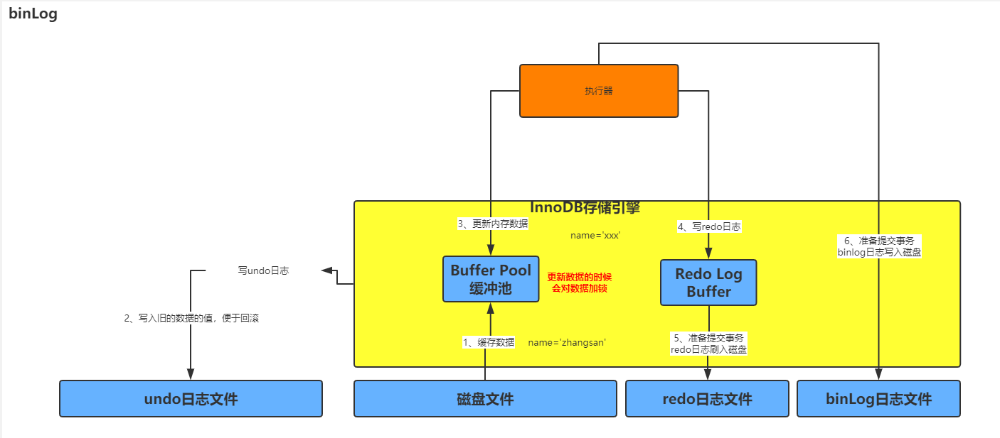
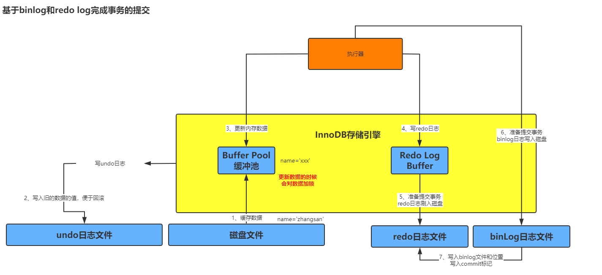
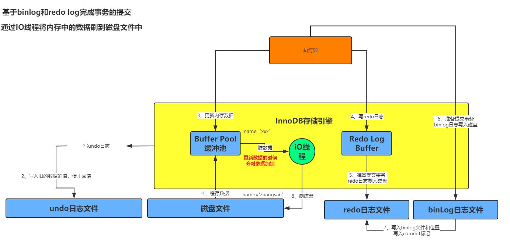

## 一、redo Log 介绍

`redo log` 是一种偏向物理性质的重做日志，因为他里面记录类似的这样的东西，“对那个数据也中的什么记录，做了个什么修改”。它是 `InnoDB` 存储引擎特有的东西。

## 二、bin Log 日志

`bin log` 叫做归档日志，它里面记录的是偏于逻辑性的日志， 类似 `对 users 表中的 id=10 的一行数据做了更新操作，更新以后的值是什么`。它不是 InnoDB 存储引擎特有的日志文件，属于 `mysql server` 日志文件。

当事务提交的时候，redo log日志会写入磁盘文件中。其实在提交事务的时候，我们同时还会把这次更新对应的binlog日志写入磁盘的文件中。

## 三、bin Log 的刷盘策略

通过 `sync_binlog` 参数可以设置刷盘策略。参数为 `0`（默认值是 0）当 binlog 写入磁盘的时候，其实不是直接进入磁盘文件，而是进入 os cache 内存缓存。但是如果此时服务器宕机，存在os cache里的binlog日志是会丢失的。参数为 `1` 强制在提交事务的时候，binlog直接写入磁盘文件中，那么这样提交事务之后，哪怕机器宕机，磁盘上的binlog是不会丢失的。

## 四、基于 bin Log 和 redo Log 完成事务的提交

当我们把binlog写入磁盘文件后，接着就会完成最终事务的提交，此时会把本次更新对应的binlog文件名和这次binlog日志在文件里的位置，都写入到redo log文件中，同时在redo log日志文件里写入一个commit标记。在完成这件事情之后，才算最终完成了事务的提交。写入commit标记的意义是保持，redo log 和 binlog 日志保持一致的。

## 五、脏数据刷回磁盘

当上面的步骤执行完成之后，最后会有一个线程去随机的把buffer pool的修改后的数据刷回到磁盘中。即使mysql服务宕机也没有关系，因为所有修改后的数据都在redo log中了。