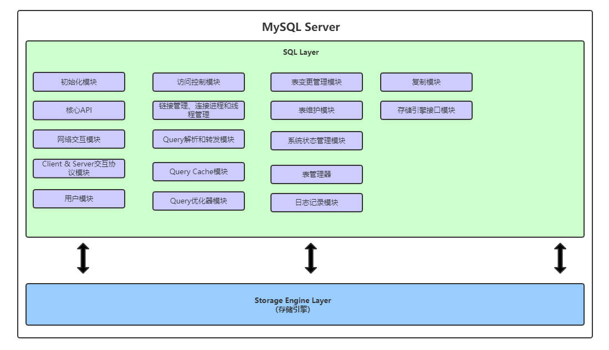

## 一、日志文件：

- 错误日志 Error Log：错误日志记录了MySQL Server运行过程中所有较为严重的警告和错误信息，以及MySQL Server每次启动和关闭的详细信息。
- 二进制日志（binLog）：Binary Log & Binary Log Index：二进制日志，也就是我们常说的`binLog`，也是MySQL Server重要的日志之一。主要记录修改，删除，新增的操作。
- 查询日志 query log：`查询日志`记录MySQL中所有的query操作。
- 慢查询日志 slow query log：慢查询日志记录的是执行时间较长的query操作。
- Innodb的在线redo日志 innodb redo log：Innodb是一个事务安全的存储引擎。

## 二、数据文件：

- `.frm`：表相关的元数据信息都放在`.frm`文件中，包括表的结构的定义信息等。一个表对应一个`.frm`文件。
- `.MYD`：`.MYD`文件是MyISAM存储引擎专用，存放MyISAM表的数据。
- `.MYI`: `.MYI`文件是MyISAM存储引擎专用，主要存放索引相关信息。
- `.ibd`文件和`ibdata`文件：`.ibd`文件和`ibdata`文件主要是innodb存储引擎数据文件。

## 三、MySQLServer系统架构

- 逻辑模块组成：

- 调用过程：
