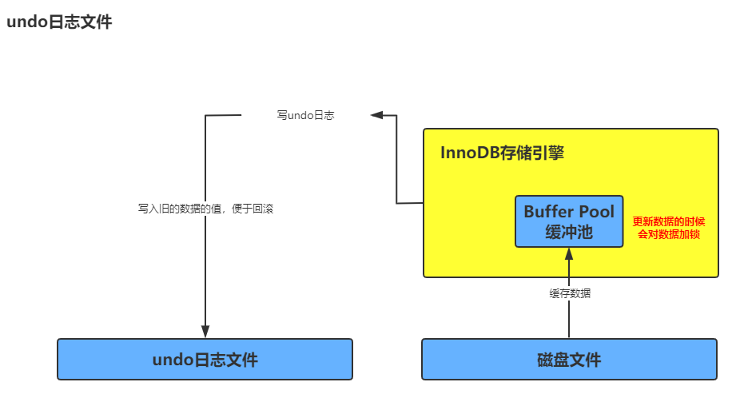
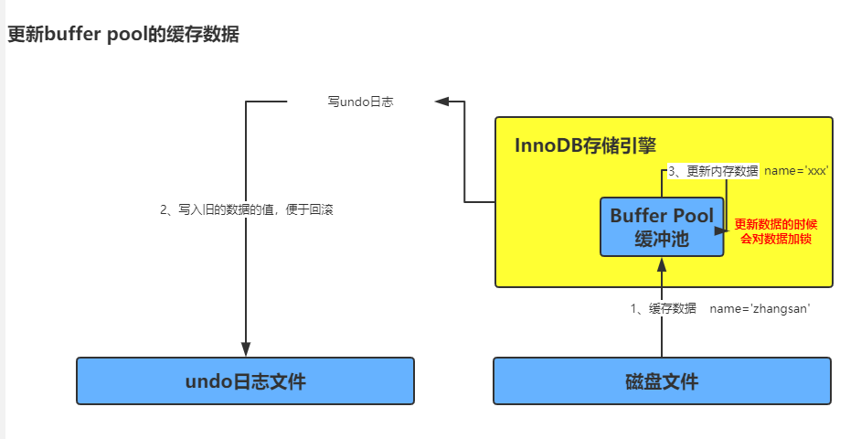
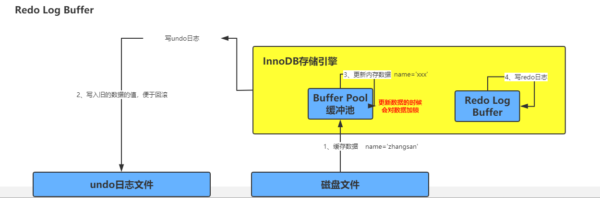

首先看一下这个 SQL 语句你会不会写? 下面是说明执行这个 SQL 语句，数据库底层做了什么操作。

```sql
    update users set name='xxx' where id=10;
```
在引擎要执行更新语句的时候，比如更新 `id=10` 这行数据时，他会先查看数据在缓冲池中是否存在，如果缓冲池中没有，会直接从磁盘中加载到缓冲池中，而且会对这行数据添加独占锁。


接着上面的继续，假设 `id=10` 这行数据的 name 原来是 `zhangsan`，现在要更新为 `xxx`，那么此时我们的先把要更新的原来的值 `zhangsan` 和 `id=10`，写入到 undo 日志文件中。



当数据从磁盘中加载数据到内存，然后将旧的数据写入到undo文件中之后，这个时候就会开始更新缓冲池中的数据，这个时候的数据是脏数据。因为这个时候还没有将更新后的数据持久化到磁盘上。



上面已经把内存中的数据更新了，还没将数据持久化到磁盘上，但是这个时候如果数据库宕机，数据就会丢失，这个时候数据又出现了`redo log buffer`内存区域，将你修改的数据存放在这个里面。比如：`name=xxx` 这个就会存在里面。如果事务没有提交的话，数据库宕机了 `redo log buffer`也会丢失。其实这个时候是没有关系的，这个时候如果重启数据库，数据其实还是没有修改之前的数据。



事务提交将 redo 日志写入到磁盘中，利用 `innodb_flush_log_at_trx_commit` 配置策略来将 redo 数据持久化到硬盘上
- 参数是0：
    - 这个时候是不会将数据持久化到硬盘上的。
- 参数是1：
    - 这个时候一定会将数据持久化到磁盘上，即使还没持久化到硬盘上的时候数据库宕机了，但是当数据库重启时，会根据`redo`将数据持久化到硬盘上。
- 参数时2：
    - 这个时候会将数据存到 `os cache` 中，如果这个时候数据库宕机了。数据还是会丢失。