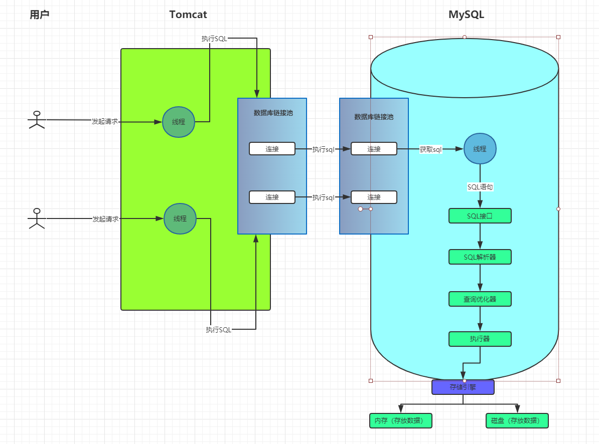

## 从用户调用到SQL执行的流程中间发生了什么事情

1、网络请求使用 `线程` 来处理，当数据库连接池中监听到有连接请求，这个时候会分配一个线程来处理。

2、`SQL接口` 负责接收 SQL 语句，当线程监听到有请求和读取数据的之后，将 SQL 语句交给 SQL 接口执行 SQL。

3、`SQL解析器` 的作用是能让数据库看懂的语句。比如：`select id,name,age from users where id=1;` 会解析成 从 `users` 表查询数据；查询 `id` 字段的值等于1的那条数据；对查询那条数据提取出里面的 `id, name, age`三个字段。

4、查询优化器的作用是选择一条最优路线查询
- 方式1：直接定位到 `users` 表中的 `ID` 字段等于1的那一行数据，然后查询出来`id`的值为1的那条数据。将`id, name, age`取出来就行了。
- 方式2：先把`users`表中每一行数据的`id, name, age`查询出来，然后从这批数据中过滤出`ID`为1的数据。

5、执行器：执行器根据查询优化器生成的执行计划调用存储引擎的接口完成SQL语句。

6、存储引擎：真正执行sql的地方，这个里面又会区分出是调用`内存中的数据`还是`磁盘上的数据`。