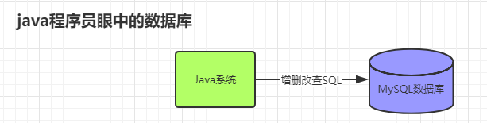
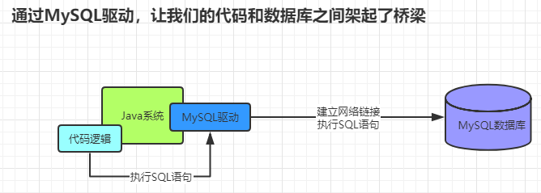
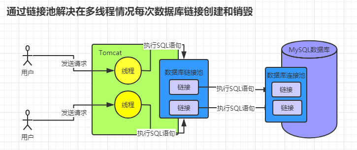

## 一、宏观的查看系统怎么和数据库交互

在我们刚刚接触系统和数据库的时候不明白其中的原理，只知道系统和数据库是需要交互的。所以我们会理解成上图的形式。

## 二、MYSQL 驱动
 

随着我们的学习时间的加长以及对程序的了解，发现链接数据库是需要有别的工具辅助的。这个时候让我们认识了 MYSQL 数据库驱动。他是可以帮助我们链接数据库，并对数据库通过一些特定的语句进行操作。

## 三、链接池
 

当我们的系统进行完善之后，将项目部署上线随着用户量的增加，发现我们的项目出现了数据库链接出现了超过链接的报错。系统在和数据库建立关系之后每次请求连接都需要重新建立和销毁，这个肯定是有问题的，我们想要有些情况下不要断开链接。这个时候通过我们的技术调研发现了 `数据库链接池` 的概念。