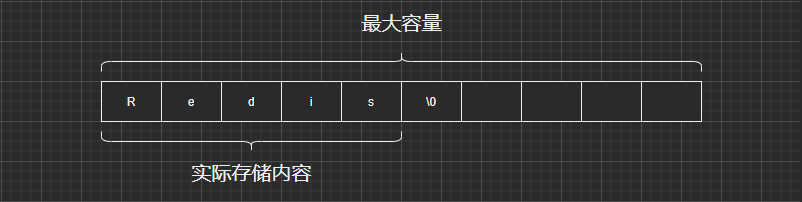

## 一、概述    
string 类型底层实现的简单动态字符串 sds，是可以修改的字符串。它采用预分配冗余空间的方式来减少内存的频繁分配。

## 二、SDS动态字符串


`动态字符串` 是以 **\0** 为分隔符。`最大容量` 是 redis 主动分配的一块内存空间，`实际存储内容` 是具体的存的数据。

## 三、SDS（动态字符串）与 c语言 字符串的区别

1、获取存储长度不同

`c语言：`c语言不记录长度信息，如果要获取字符串的长度，需要遍历所有的字符串，才能获取字符串的长度。获取长度的复杂度为 **O(n)**。

`sds（动态字符串）：`sds存储了字符串的长度，获取长度的复杂度为 **O(1)**。

2、缓存溢出

`c语言：`c语言不记录长度，在执行strcat函数时，假设分配了内存，存储的内容比已经分配的内存多时，这个时候就会出现缓冲区溢出现象。

`sds（动态字符串）：`sds存储内容时，先检查内容的存储是否能够存储下实际的值，如果不能存储实际的值，就先扩展缓存区域，再将值存储到缓冲区域中。

3、内存的开辟和释放

`c语言：`需要自己主动释放或者扩展内存，如果不能够主动释放或者扩展内存，就会出现缓冲溢出或者泄露。    
`sds（动态字符串）：`sds采取下面的方式

```java
// 空间预分配 先进行内存区域进行扩展,然后在执行下面的代码
public void  test(){
    if(len < 1M){
    //程序分配和len属性一样的大小未使用的空间。
    } else if (len > 1M){
    //程序分配1M 未使用的空间。
    }
}

// 惰性空间释放 
// 在修改字符串时，如果实际的内容要比老的数据小，先不将缓冲区的空闲内存释放掉，等下次存储内容时再进行空间的释放或者扩展。
```

4、二进制安全

`c语言：`C语言必须存储指定的格式数据。  
`sds（动态字符串）：`SDS不会对数据限制。