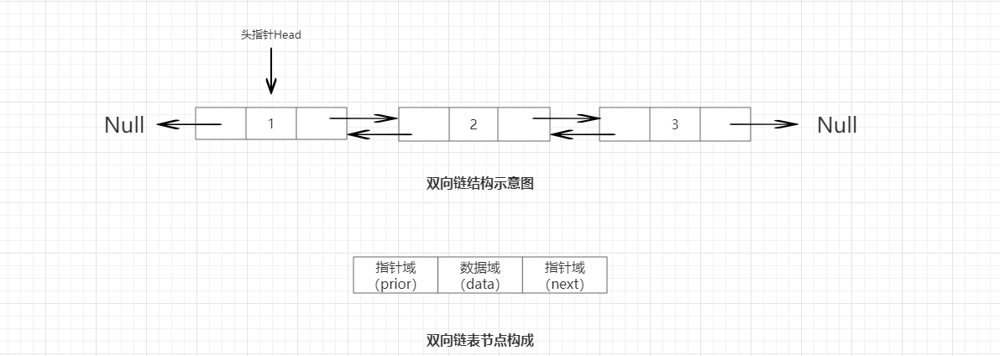

## 一、数组和链表

1、数组

数组会在内存中开辟一块连续的空间存储数据，这种存储方式有利也有弊端。当获取数据的时候，直接通过下标值就可以获取到对应的元素，时间复杂度为 `O(1)`。但是如果新增或者删除数据会移动大量的数据，时间复杂度为 `O(n)`。数组的扩容机制是：如果数组空间不足，会先开辟一块新的空间地址，将原来的数组复制到新的数组中。 

2、链表

链表不需要开辟连续的内存空间，其通过指针将所有的数据连接起来。新增或者删除的时候只需要将指针指向的地址修改就行了，时间复杂度为 `O(1)`。但是查询的时间复杂度为 `O(n)`。


## 二、链表

1、双向链表


双向链表是各个节点之间的逻辑关系是双向的。  
双向链表中节点的组成是：`prior：` 指向当前节点的前置节点，`data：`当前节点存储的数据。`next：`指向当前节点的后置节点。

2、压缩链表
- 压缩链表是为了节约内存开发的。
- ziplist是一个特别的双向链表，没有维护双向指针prev next;反而是存储上一个entry的长度和当前entry长度，通过长度推算出下一个元素在什么地方。
- 牺牲读取的性能，获得高效的存储空间，因为存储指针比存储entry长度更费内存，这就是典型的时间换空间。

3、quicklist链表

- 官网介绍：
```java
    A doubly linked list of ziplists
    A generic doubly linked quicklist implementation
```

- 介绍:  
quicklist是一个双向链表，并且是一个ziplist的双向链表，ziplist本身是一个维持数据项先后顺序的列表，而且数据项保存在一个连续的内存块种。

## 三、对比
1、双向链表
- 双端链表便于在表的两端进行push和pop操作，但是它的内存开销比较大。
- 双端链表每个节点上除了要保存的数据之外，还要额外保存两个指针。
- 双端链表的各个节点是单独的内存块，地址不连续，节点多了容易产生内存碎片。

2、压缩列表

- ziplist由于是一块连续的内存，所以存储效率很高。
- ziplist不利于修改操作，每次数据变动都会引发一次内存的realloc。
- 当ziplist长度很长的时候，一次realloc可能会导致大批量的数据拷贝，进一步降低性能。

3、quicklist链表
- 空间效率和时间效率的折中。
- 结合了双端链表和压缩列表的优点。

## 四、总结
在 `redis 3.2` 版本之前使用的是 `双向链表和压缩链表` 两种，因为双向链表占用的内存要比压缩链表高，所以创建链表时首先会创建 `压缩链表`，在合适的时机会转化成`双向链表`。`redis 3.2` 之后使用的是 `quicklist链表`。
