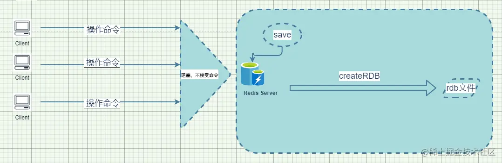

## 一、概述
Redis 是内存数据库，如果不能将内存中的数据保存到磁盘中，那么一旦服务器进程退出，数据库中数据会消失，所以 Redis 提供了持久化的功能, Redis 分为两种持久化方式：**RDB** 和 **AOF**，有以下几个特点：  
- 1、RDB持久化方式能够在指定的时间间隔能对你的数据进行快照存储。  
- 2、AOF持久化方式记录每次对服务器写的操作，当服务器重启的时候会重新执行这些命令来恢复原始的数据，AOF 命令以 Redis 协议追加保存每次写的操作到文件末尾。Redis 还能对 AOF 文件后台重写，使得 AOF 文件的体积不至于过大。  
- 3、如果你只希望你的数据在服务器运行的时候存在，你也可以不使用任何持久化的方式。  
- 4、你也可以同时开启两种持久化方式，在这种情况下，当 Redis 重启的时候会优先载入 AOF 文件来恢复原始的数据。因为在通常情况下 AOF 文件保存的数据集要比 RDB 文件保存的数据集要完整。

## 二、RDB
1、概念

在指定的时间间隔内将内存中的数据集快照写入磁盘中，它恢复的时候是将快照中的文件直接读取到内存中。

2、持久化机制之BGSAVE

 

通常，会立即返回 ok，Redis 进程会执行 `fork` 操作创建子进程，Redis在 `fork` 时，父进程会继续为客户端提供服务，子进程会将数据持久化到硬盘上，然后退出。如果已经在后台执行保存或者正在运行另一个非后台保存的进程，特别是正在进行 `AOF` 写入时，则会返回错误。如果使用了 `bgsave` 任务，而正在进行 `AOF` 写入时，该命令将立即返回 ok，并计划在下一次机会运行后台保存。阻塞只会在 `fork` 阶段。  

客户端可以使用`lastsave`命令检查操作是否成功。

3、持久化机制之SAVE

  
不会接受客户端执行的操作命令，等持久化工作完成之后，会将新的文件替换旧的文件。

4、持久化机制之自动触发 

在 `redis.conf` 中可以配置，让用户自定义 `save` 属性，让服务器每一段时间内执行一次 `bgsave` 操作。
```shell
  # 服务器在900秒内，对数据库进行了至少1次修改
  save 900 1
  
  # 服务器在300秒内，对数据库进行了至少10次修改
  save 300 10
  
  # 服务器在60秒内，对数据库进行了至少10000次修改
  save 60 10000
  
  # bgsave发生错误时是否停止写入，一般为yes
  stop-writes-on-bgsave-error yes
  
  # 持久化时是否使用LZF压缩字符串对象?
  rdbcompression yes
  
  # 是否对rdb文件进行校验和检验，通常为yes
  rdbchecksum yes
  
  # RDB持久化文件名
  dbfilename dump.rdb
  
  # 持久化文件存储目录
  dir ./
```

5、恢复数据机制  

只需要将 rdb 文件放在我们 redis 启动目录就可以了，redis 启动的时候会自动检查文件并恢复其中的数据。

6、优点

- RDB 是一个非常紧凑的文件，它保存了某个时间点得数据集，非常适用于数据集的备份，比如你可以在每个小时保存一下过去24小时内的数据，同时每天保存过去30天的数据，这样即使出了问题你也可以根据需求恢复到不同版本的数据集。
- RDB 是一个紧凑的单一文件，很方便传送到另一个远端数据中心或者亚马逊的S3（可能加密），非常适用于灾难恢复。
- RDB 在保存 RDB 文件时父进程唯一需要做的就是 fork 出一个子进程，接下来的工作全部由子进程来做，父进程不需要再做其他 IO 操作，所以 RDB 持久化方式可以最大化 redis 的性能。
- 与 AOF 相比，在恢复大的数据集的时候，RDB 方式会更快一些。

7、缺点

- 如果你希望在 redis 意外停止工作（例如电源中断）的情况下丢失的数据最少的话，那么 RDB 不适合你。虽然你可以配置不同的 save 时间点(例如每隔5分钟并且对数据集有100个写的操作)，是 Redis要完整的保存整个数据集是一个比较繁重的工作，你通常会每隔5分钟或者更久做一次完整的保存，万一在Redis意外宕机，你可能会丢失几分钟的数据。

- RDB 需要经常 fork 子进程来保存数据集到硬盘上，当数据集比较大的时候，fork 的过程是非常耗时的，可能会导致 Redis 在一些毫秒级内不能响应客户端的请求。如果数据集巨大并且 CPU 性能不是很好的情况下，这种情况会持续1秒，AOF 也需要 fork，但是你可以调节重写日志文件的频率来提高数据集的耐久度。

## 三、AOF
1、概念

以日志的形式来记录每个写操作，将Redis执行过的所有指令记录下来（读操作不记录），只许追加文件但不可以改写文件，Redis 启动之初会读取该文件重新构建数据，换言之，Redis 重启的话就会根据日志文件的内容将写的指令从前到后执行一次以完成数据的恢复工作。

2、持久化原理

   
所有操作的命令会追加在文件中。

3、开启AOF持久化

```shell
# 开启aof持久化方式，默认no
appendonly no

# aof 持久化生成的文件名称
appendfilename "appendonly.aof"

# 三种持久化机制
# appendfsync always
appendfsync everysec
# appendfsync no
```

4、三种触发持久化机制

- always  
同步持久化，每次发生数据变更会被立即持久化到硬盘中，性能比较差，但是数据完整性好。

- everysec   
异步操作，每秒持久化数据到硬盘一次，可能会丢失一秒的数据。

- no  
从不持久化到硬盘。

5、AOF文件损坏

如果 aof 文件被破坏，redis 服务是启动不了的。redis 本身提供了修复了工具。`redis-check-aof --fix appendonly.aof`

6、优点

- 根据配置不同的策略，让你选择持久化的方式。
- AOF文件是一个只进行追加的日志文件，所以不需要写入seek，即使由于某些原因(磁盘空间已满，写的过程中宕机等等)未执行完整的写入命令，你也也可使用redis-check-aof工具修复这些问题。
- Redis 可以在 AOF 文件体积变得过大时，自动地在后台对 AOF 进行重写： 重写后的新 AOF 文件包含了恢复当前数据集所需的最小命令集合。 整个重写操作是绝对安全的，因为 Redis 在创建新 AOF 文件的过程中，会继续将命令追加到现有的 AOF 文件里面，即使重写过程中发生停机，现有的 AOF 文件也不会丢失。 而一旦新 AOF 文件创建完毕，Redis 就会从旧 AOF 文件切换到新 AOF 文件，并开始对新 AOF 文件进行追加操作。
- AOF 文件有序地保存了对数据库执行的所有写入操作，这些写入操作以 Redis 协议的格式保存， 因此 AOF 文件的内容非常容易被人读懂，对文件进行分析（parse）也很轻松。导出（export）AOF文件也非常简单：举个例子， 如果你不小心执行了 FLUSHALL 命令， 但只要 AOF 文件未被重写，那么只要停止服务器，移除 AOF 文件末尾的 FLUSHALL 命令，并重启 Redis，就可以将数据集恢复到 FLUSHALL 执行之前的状态。

7、缺点

- 对于相同的数据集来说，AOF 文件的体积通常要大于 RDB 文件的体积。
- 根据所使用的 fsync 策略，AOF 的速度可能会慢于 RDB 。 在一般情况下， 每秒 fsync 的性能依然非常高， 而关闭 fsync 可以让 AOF 的速度和 RDB 一样快， 即使在高负荷之下也是如此。 不过在处理巨大的写入载入时，RDB 可以提供更有保证的最大延迟时间（latency）。


## 四、如何选择持久化机制
开启两种持久化方式，根据自己的业务需求针对redis进行配置的调整。