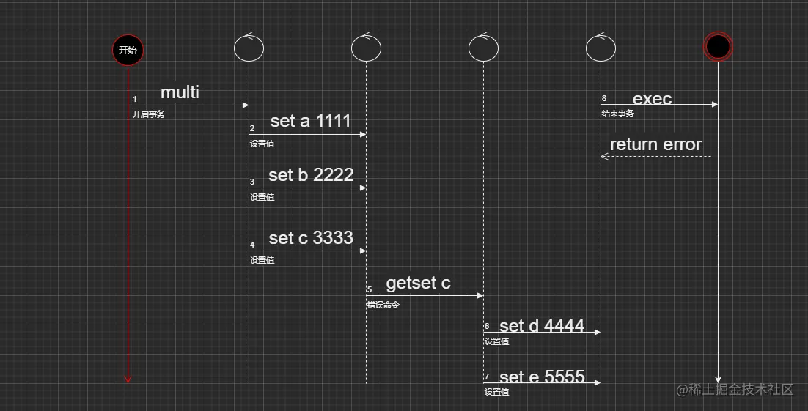

## 一、简介
事务（Transaction），一般是指要做的或所做的事情。在计算机术语中是指访问并可能更新数据库中各种数据项的一个程序执行单元 (unit)。

## 二、执行过程
开始事务 -> 命令入队 -> 执行事务。

## 三、特点
1、批量操作在发送 `exec` 命令前被放入队列缓存。  

2、收到 `exec` 命令后进入事务执行，事务中任意命令执行失败，其余的命令依然会被执行。  

3、在事务的执行过程中，其他客户端提交的命令请求不会插入到事务执行命令的序列中。
  
## 四、案例
1、正常执行
```shell
localhost:6379> multi
OK
localhost:6379> set a 1111
QUEUED
localhost:6379> set b 2222
QUEUED
localhost:6379> set c 3333
QUEUED
localhost:6379> set d 4444
QUEUED
localhost:6379> exec
1) OK
2) OK
3) OK
4) OK
```

2、取消事务
```shell
localhost:6379> multi
OK
localhost:6379> set e 55555
QUEUED
localhost:6379> set f 66666
QUEUED
localhost:6379> discard
OK
localhost:6379> exec
(error) ERR EXEC without MULTI
```

3、编译型错误


  最后执行 `exec` 命令之后，会执行队列中的命令，队列中命令有失败的，所以最后整个命令都执行失败。  
  编译型异常代码有问题，命令有错，事务中所有的命令都不会被执行。编译型错误就是你 redis 相关命令写错误。
  
4、运行时错误
```java
    localhost:6379> set a qqqq
    OK
    localhost:6379> multi
    OK
    localhost:6379> incr a
    QUEUED
    localhost:6379> set b 1111
    QUEUED
    localhost:6379> set c 2222
    QUEUED
    localhost:6379> set d 3333
    QUEUED
    localhost:6379> exec
    1) (error) ERR value is not an integer or out of range
    2) OK
    3) OK
    4) OK
    localhost:6379> keys *
    1) "a"
    2) "c"
    3) "b"
    4) "d"
```
如果事务队列存在语法错误，那么执行命令的时候，其他命令是可以正常执行的，错误命令抛出异常。

## 五、watch
Watch 命令用于监视一个(或多个) key ，如果在事务执行之前这个(或这些) key 被其他命令所改动，那么事务将被打断。

- 监控 `a` 时，`a` 被修改
```java
//客户端1
    localhost:6379> set a 1111
    OK
    localhost:6379> WATCH a
    OK
    localhost:6379> MULTI
    OK
    localhost:6379> set a 2222
    QUEUED
    localhost:6379> exec
    (nil)

//客户端2
    127.0.0.1:6379> set a 567
    OK
```

- 正常 `watch`
```java
localhost:6379> set a 1111
OK
localhost:6379> WATCH a
OK
localhost:6379> MULTI
OK
localhost:6379> set b 222
QUEUED
localhost:6379> set c 333
QUEUED
localhost:6379> set d 444
QUEUED
localhost:6379> exec
1) OK
2) OK
3) OK
localhost:6379> keys *
1) "a"
2) "c"
3) "b"
4) "d"

```