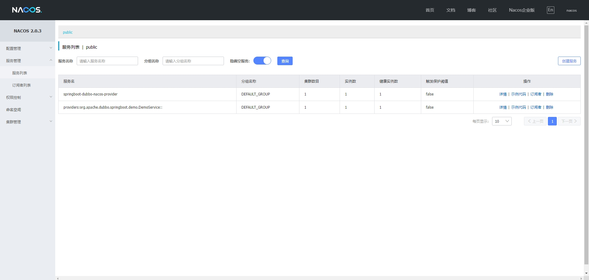

## 一、环境准备

本章将通过手把手的教程一步一步教你如何从零开发一个微服务应用。

首先需要安装好 `nacos` 服务并启动。安装 `nacos` 服务请看作者的 `【nacos 第一篇章】安装一下 nacos` 文章。

## 二、初始化项目


如上图所示，可以建立一个基础的项目。

搭建了基础项目之后，我们还需要创建 `springboot-dubbo-nacos-interface` 、`springboot-dubbo-nacos-provider` 和 `springboot-dubbo-nacos-consumer` 三个子模块。

1、开始创建第一个子工程，这个是所有创建子工程的选择的地方


2、开始创建 `springboot-dubbo-nacos-interface` 工程


3、开始创建 `springboot-dubbo-nacos-provider` 工程

参照 `interface` 工程的方式，创建 `provider` 子工程。

4、开始创建 `springboot-dubbo-nacos-consumer` 工程

参照 `interface` 工程的方式，创建 `consumer` 子工程。

## 三、创建相关目录，根据下面的方式创建包，并且查看创建完成的项目结构

创建了三个子模块之后，需要创建一下几个包（package）：

- 在 springboot-dubbo-nacos-consumer/src/main/java 下创建 org.apache.dubbo.springboot.demo.consumer

- 在 springboot-dubbo-nacos-interface/src/main/java 下创建 org.apache.dubbo.springboot.demo

- 在 springboot-dubbo-nacos-provider/src/main/java 下创建 org.apache.dubbo.springboot.demo.provider


## 四、添加 maven 依赖

首先，在 `springboot-dubbo-nacos` 目录下的 `pom.xml` 配置以下信息，配置完成之后记得刷新一下 `maven` 配置。

```java
<?xml version="1.0" encoding="UTF-8"?>
<project xmlns="http://maven.apache.org/POM/4.0.0"
         xmlns:xsi="http://www.w3.org/2001/XMLSchema-instance"
         xsi:schemaLocation="http://maven.apache.org/POM/4.0.0 http://maven.apache.org/xsd/maven-4.0.0.xsd">
    <modelVersion>4.0.0</modelVersion>

    <groupId>org.example</groupId>
    <artifactId>springboot-dubbo-nacos</artifactId>
    <version>1.0-SNAPSHOT</version>
    <packaging>pom</packaging>
    <modules>
        <module>springboot-dubbo-nacos-interface</module>
        <module>springboot-dubbo-nacos-provider</module>
        <module>springboot-dubbo-nacos-consumer</module>
    </modules>

    <properties>
        <dubbo.version>3.2.0-beta.4</dubbo.version>
        <nacos.version>0.3.0-RC</nacos.version>
        <spring-boot.version>2.7.8</spring-boot.version>
        <maven.compiler.source>17</maven.compiler.source>
        <maven.compiler.target>17</maven.compiler.target>
        <project.build.sourceEncoding>UTF-8</project.build.sourceEncoding>
    </properties>

    <dependencyManagement>
        <dependencies>
            <!-- Spring Boot -->
            <dependency>
                <groupId>org.springframework.boot</groupId>
                <artifactId>spring-boot-dependencies</artifactId>
                <version>${spring-boot.version}</version>
                <type>pom</type>
                <scope>import</scope>
            </dependency>

            <!-- Dubbo -->
            <dependency>
                <groupId>org.apache.dubbo</groupId>
                <artifactId>dubbo-bom</artifactId>
                <version>${dubbo.version}</version>
                <type>pom</type>
                <scope>import</scope>
            </dependency>

            <dependency>
                <groupId>com.alibaba.boot</groupId>
                <artifactId>nacos-config-spring-boot-starter</artifactId>
                <version>${nacos.version}</version>
            </dependency>

            <dependency>
                <groupId>com.alibaba.spring</groupId>
                <artifactId>spring-context-support</artifactId>
                <version>1.0.11</version>
            </dependency>

            <!-- https://mvnrepository.com/artifact/org.springframework.boot/spring-boot-starter-web -->
            <dependency>
                <groupId>org.springframework.boot</groupId>
                <artifactId>spring-boot-starter-web</artifactId>
                <version>2.7.8</version>
            </dependency>

        </dependencies>

    </dependencyManagement>

    <build>
        <pluginManagement>
            <plugins>
                <plugin>
                    <groupId>org.springframework.boot</groupId>
                    <artifactId>spring-boot-maven-plugin</artifactId>
                    <version>${spring-boot.version}</version>
                </plugin>
            </plugins>
        </pluginManagement>
    </build>

</project>
```

然后在 `springboot-dubbo-nacos-consumer` 和 `springboot-dubbo-nacos-provider` 两个模块 pom.xml 中进行具体依赖的配置。

首先配置 `springboot-dubbo-nacos-consumer/pom.xml` 文件：

```java
<?xml version="1.0" encoding="UTF-8"?>
<project xmlns="http://maven.apache.org/POM/4.0.0"
         xmlns:xsi="http://www.w3.org/2001/XMLSchema-instance"
         xsi:schemaLocation="http://maven.apache.org/POM/4.0.0 http://maven.apache.org/xsd/maven-4.0.0.xsd">
    <modelVersion>4.0.0</modelVersion>
    <parent>
        <groupId>org.example</groupId>
        <artifactId>springboot-dubbo-nacos</artifactId>
        <version>1.0-SNAPSHOT</version>
    </parent>

    <artifactId>springboot-dubbo-nacos-consumer</artifactId>

    <properties>
        <maven.compiler.source>17</maven.compiler.source>
        <maven.compiler.target>17</maven.compiler.target>
        <project.build.sourceEncoding>UTF-8</project.build.sourceEncoding>
    </properties>

    <dependencies>
        <dependency>
            <groupId>org.example</groupId>
            <artifactId>springboot-dubbo-nacos-interface</artifactId>
            <version>${project.parent.version}</version>
        </dependency>

        <!-- dubbo -->
        <dependency>
            <groupId>org.apache.dubbo</groupId>
            <artifactId>dubbo-spring-boot-starter</artifactId>
        </dependency>

        <!-- nacos -->
        <dependency>
            <groupId>com.alibaba.boot</groupId>
            <artifactId>nacos-config-spring-boot-starter</artifactId>
        </dependency>

        <!-- spring boot starter -->
        <dependency>
            <groupId>org.springframework.boot</groupId>
            <artifactId>spring-boot-starter</artifactId>
        </dependency>

        <dependency>
            <groupId>org.springframework.boot</groupId>
            <artifactId>spring-boot-starter-web</artifactId>
        </dependency>

    </dependencies>

</project>
```

然后配置 `springboot-dubbo-nacos-provider/pom.xml` 文件：

```java
<?xml version="1.0" encoding="UTF-8"?>
<project xmlns="http://maven.apache.org/POM/4.0.0"
         xmlns:xsi="http://www.w3.org/2001/XMLSchema-instance"
         xsi:schemaLocation="http://maven.apache.org/POM/4.0.0 http://maven.apache.org/xsd/maven-4.0.0.xsd">
    <modelVersion>4.0.0</modelVersion>
    <parent>
        <groupId>org.example</groupId>
        <artifactId>springboot-dubbo-nacos</artifactId>
        <version>1.0-SNAPSHOT</version>
    </parent>

    <artifactId>springboot-dubbo-nacos-provider</artifactId>

    <properties>
        <maven.compiler.source>17</maven.compiler.source>
        <maven.compiler.target>17</maven.compiler.target>
        <project.build.sourceEncoding>UTF-8</project.build.sourceEncoding>
    </properties>

    <dependencies>
        <dependency>
            <groupId>org.example</groupId>
            <artifactId>springboot-dubbo-nacos-interface</artifactId>
            <version>${project.parent.version}</version>
        </dependency>

        <!-- dubbo -->
        <dependency>
            <groupId>org.apache.dubbo</groupId>
            <artifactId>dubbo-spring-boot-starter</artifactId>
        </dependency>

        <!-- nacos -->
        <dependency>
            <groupId>com.alibaba.boot</groupId>
            <artifactId>nacos-config-spring-boot-starter</artifactId>
        </dependency>

        <!-- spring boot starter -->
        <dependency>
            <groupId>org.springframework.boot</groupId>
            <artifactId>spring-boot-starter</artifactId>
        </dependency>

    </dependencies>

</project>
```

## 五、在 `springboot-dubbo-nacos-interface` 工程中定义接口

```java
public interface DemoService {
    String sayHello(String name);
}
```

## 六、在 `springboot-dubbo-nacos-provider` 实现接口

```java
package org.apache.dubbo.springboot.demo.provider;

import org.apache.dubbo.config.annotation.DubboService;
import org.apache.dubbo.springboot.demo.DemoService;

@DubboService
public class DemoServiceImpl implements DemoService {
    @Override
    public String sayHello(String name) {
        return "My Name Is " + name + "Provider";
    }
    
}
```

## 七、在 `springboot-dubbo-nacos-provider` 配置 `application.yml` 文件

```java
dubbo:
  application:
    name: springboot-dubbo-nacos-provider
  protocol:
    name: dubbo
    port: -1  # -1 表示自动分配端口
  registry:
    address: nacos://127.0.0.1:8848
```

## 八、在 `springboot-dubbo-nacos-provider` 配置核心启动类，并启动服务

```java
package org.apache.dubbo.springboot.demo.provider;


import org.apache.dubbo.config.spring.context.annotation.EnableDubbo;
import org.springframework.boot.SpringApplication;
import org.springframework.boot.autoconfigure.SpringBootApplication;

@EnableDubbo
@SpringBootApplication
public class ProviderApplication {
    public static void main(String[] args) {
        SpringApplication.run(ProviderApplication.class, args);
    }
}

```

## 九、查看 `nacos` 服务中是否注册成功



## 十、在 `springboot-dubbo-nacos-consumer` 配置 `application.yml` 文件

```java
server:
  port: 8888

dubbo:
  application:
    name: springboot-dubbo-nacos-consumer
  protocol:
    name: dubbo
    port: -1  # -1 表示自动分配端口
  registry:
    address: nacos://${nacos.address:127.0.0.1}:8848
```

## 十一、在 `springboot-dubbo-nacos-consumer` 配置核心启动类

```java
package org.apache.dubbo.springboot.demo.consumer;

import org.apache.dubbo.config.spring.context.annotation.EnableDubbo;
import org.springframework.boot.SpringApplication;
import org.springframework.boot.autoconfigure.SpringBootApplication;

@EnableDubbo
@SpringBootApplication
public class ConsumerApplication {

    public static void main(String[] args) {
        SpringApplication.run(ConsumerApplication.class, args);
    }

}

```

## 十二、在 `springboot-dubbo-nacos-consumer` 创建 `DemoController` 类

```java
package org.apache.dubbo.springboot.demo.consumer;


import org.apache.dubbo.config.annotation.DubboReference;
import org.apache.dubbo.springboot.demo.DemoService;
import org.springframework.web.bind.annotation.GetMapping;
import org.springframework.web.bind.annotation.RequestMapping;
import org.springframework.web.bind.annotation.RestController;

@RestController
@RequestMapping(value = "/demo")
public class DemoController {

    @DubboReference
    private DemoService demoService;

    @GetMapping("/sayHello")
    public String sayHello(String name) {
        return demoService.sayHello(name);
    }
}

```

## 十三、访问请求验证结果

在浏览器中输入 `http://localhost:8888/demo/sayHello?name=测试`。能看到正确的响应结果。
