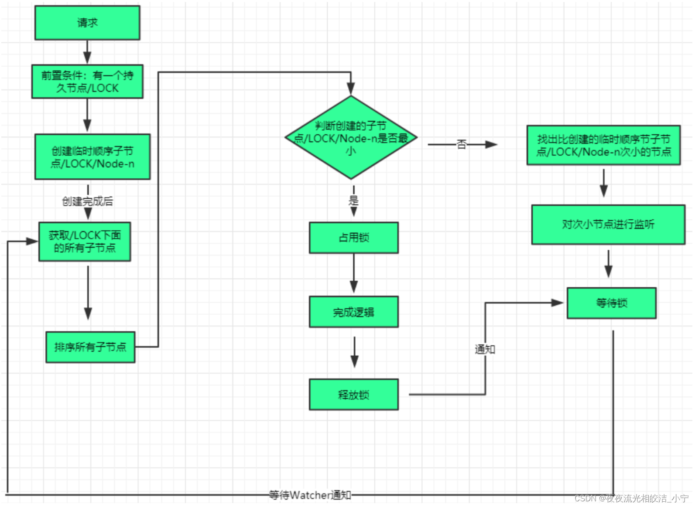

## 一、分布式锁
分布式锁是控制分布式系统之间同步访问共享资源的一种方式。

## 二、zookeeper 分布式锁

1、客户端A创建临时顺序节点 `demo`。并在节点下创建 `x_00000001`。 

2、客户端A判断是否自己是第一个节点，如果是就锁成功。 

3、客户端B创建临时顺序节点 `demo`。 并在节点下创建 `x_00000002`。 

4、客户端B判读是否自己是第一个节点，如果是第一个节点，就加锁成功。如果不是第一个节点就会创建第二个节点，然后创建一个监听器，监听上一个节点。 

5、客户端A执行完业务逻辑之后，会释放锁，并且会删除顺序节点 `x_00000001`。 

6、zookeeper 服务器会通知客户端B，上级节点已经删除了。 

7、客户端B会重新加锁。  

## 三、注意事项
用临时顺序节点，如果某个客户端创建临时节点之后，不小心自己宕机了，zookeeper 服务器感知到哪个客户端宕机了，会自动删除对应的顺序节点。