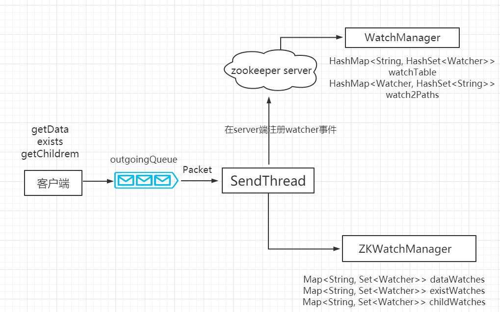

## 一、Watcher 概述    
zookeeper 提供了数据的 `发布/订阅功能`，多个订阅者可同时监听某一特定的主题对象，当主题对象的自身状态发生了变化时（例如节点内容发生了改变、节点下的子节点列表发生改变等），会实时、主动的通知所有订阅者。


## 二、Watcher 架构
Watcher 由三部分组成 `zookeeper服务端`、`zookeeper客户端`、`客户端的watchManager对象`。  



客户端首先将 Watcher 注册到服务器，同时将 Watcher 对象保存到客户端的 `Watcher管理器` 中。当 zookeeper 服务器端监听数据状态发生变化时，服务端会主动通知客户端，接着 `客户端的Watcher` 管理器会触发相关的 Watcher 来回调相应的处理逻辑，从而完成整体的数据的发布/订阅流程。

## 三、Watcher 特性
| 特性    |  说明   |
| --- | --- |
| 一次性    |  watcher是一次性的，一旦被触发就会被移除，再次使用时需要重新注册。 |
| 客户端顺序回调    |  watcher 回调的顺序是串行化执行的，只有回调后客户端才能看到最新的数据状态。|
| 轻量级    | watcherEvent是最小的通信单元，结构上只包含通知状态、事件类型和节点路径，并不会告诉数据节点变化前后的具体内容。 |
| 时效性 |  watcher只有在当前的session彻底失效时才会无效，若在session有效内快速重连成功，则watcher依然存在，依然可以接收到通知。|

## 四、Watcher 通知状态（KeeperState）
| 枚举属性    |  说明   |
| --- | --- |
| SyncConnected    | 客户端和服务端正常连接    |
| Disconnected    |  客户端和服务端断开连接   |
| Expired    |  会话session失效   |
| AuthFailed    |  身份认证失败  |

## 五、Watcher 事件类型（EventType）
| 枚举属性    |  说明   |
| --- | --- |
| None   |  无   |
| NodeCreated   |  数据的节点创建   |
| NodeDeleted    | 数据的节点删除   |
| NodeDataChanged   |  数据节点内容发生变更时    |
| NodeChildrenChanged    |  节点的子节点列表发生变更时   |


## 六、案例
1、状态获取
```java
package com.snails.zookeeper;

import org.apache.zookeeper.WatchedEvent;
import org.apache.zookeeper.Watcher;
import org.apache.zookeeper.ZooKeeper;

import java.util.concurrent.CountDownLatch;

public class ZkConnectionWatcher implements Watcher {

    //计数器对象
    static CountDownLatch countDownLatch = new CountDownLatch(1);
    //链接对象
    static ZooKeeper zookeeper;

    @Override
    public void process(WatchedEvent event) {

        try {
            //事件类型
            if(event.getType() == Event.EventType.None) {
                if(event.getState() == Event.KeeperState.SyncConnected ) {
                    System.out.println("创建连接成功"); //当连接到zookeeper服务器时，会执行这一块的代码块。
                    countDownLatch.countDown();
                } else if (event.getState() == Event.KeeperState.Disconnected) {
                    System.out.println("断开连接");    //  当和zookeeper服务器断开连接时，会执行这一块代码。
                                                      // 当网络重新连接成功连接成功之后，并且在sessionTimeOut设置的范围之内，会自动重新连接到服务器上。
                } else if (event.getState() == Event.KeeperState.Expired) {
                    System.out.println("会话超时");  // 当网络时间超过sessionTimeOut设置的时长时，会执行这一块代码。
                    zookeeper = new ZooKeeper("127.0.0.1:2181", 5000, new ZkConnectionWatcher()); //网络超时一般设置重新连接
                } else if (event.getState() == Event.KeeperState.AuthFailed) {
                    System.out.println("认证失败");
                }
            }
        } catch (Exception e) {
            e.printStackTrace();
        }

    }

    public static void main(String[] args) {
        try {
            zookeeper = new ZooKeeper("127.0.0.1:2181", 5000, new ZkConnectionWatcher());

            //通过授权模式获取节点数据
            zookeeper.addAuthInfo("digest", "woniu:123456".getBytes());
            byte[] data = zookeeper.getData("/woniu", false, null);
            System.out.println(new String(data));

            countDownLatch.await();

            System.out.println(zookeeper.getSessionId());

            Thread.sleep(50000);

            zookeeper.close();

            System.out.println("结束");
        } catch (Exception e) {
            e.printStackTrace();
        }
    }

}

```

2、Watcher三种API之Exists
```java
package com.snails.zookeeper;

import org.apache.zookeeper.KeeperException;
import org.apache.zookeeper.WatchedEvent;
import org.apache.zookeeper.Watcher;
import org.apache.zookeeper.ZooKeeper;
import org.junit.After;
import org.junit.Before;
import org.junit.Test;
import java.io.IOException;
import java.util.concurrent.CountDownLatch;

public class ZkWatcherExists {

    String Ip = "127.0.0.1:2181";
    ZooKeeper zooKeeper = null;

    @Before
    public void before() throws IOException, InterruptedException {
        CountDownLatch countDownLatch = new CountDownLatch(1);

        zooKeeper = new ZooKeeper(Ip, 60000, new Watcher() {
            @Override
            public void process(WatchedEvent event) {
                if(event.getState() == Event.KeeperState.SyncConnected) {
                    countDownLatch.countDown();
                }
                try {
                    //解决一次性的问题，就是每次节点的修改，不用重启客户端。
                    zooKeeper.exists("/woniu1",this);
                } catch (KeeperException e) {
                    e.printStackTrace();
                } catch (InterruptedException e) {
                    e.printStackTrace();
                }
                System.out.println("path= " + event.getPath());
                System.out.println("path= " + event.getType());
            }
        });
        countDownLatch.await();
    }

    @After
    public void after() throws InterruptedException {
        zooKeeper.close();
    }


    @Test
    public void watchderFunction01() throws KeeperException, InterruptedException {
        zooKeeper.exists("/woniu1", true);

        Thread.sleep(500000);

        System.out.println("end-----");
    }

    //注册多个监听器
    @Test
    public void watchderFunction02() throws KeeperException, InterruptedException {
        zooKeeper.exists("/woniu1", new Watcher() {
            @Override
            public void process(WatchedEvent event) {
                System.out.println("监听woniu1 ===================");
                System.out.println("path= " + event.getPath());
                System.out.println("path= " + event.getType());
            }
        });

        zooKeeper.exists("/woniu2", new Watcher() {
            @Override
            public void process(WatchedEvent event) {
                System.out.println("监听woniu2 ===================");
                System.out.println("path= " + event.getPath());
                System.out.println("path= " + event.getType());
            }
        });

        Thread.sleep(500000);
        System.out.println("end-----");
    }
}
```

3、Watcher三种API之getData
```java
package com.snails.zookeeper;

import org.apache.zookeeper.KeeperException;
import org.apache.zookeeper.WatchedEvent;
import org.apache.zookeeper.Watcher;
import org.apache.zookeeper.ZooKeeper;
import org.junit.After;
import org.junit.Before;
import org.junit.Test;
import java.io.IOException;
import java.util.concurrent.CountDownLatch;

public class ZkWatcherGetData {

    String Ip = "127.0.0.1:2181";
    ZooKeeper zooKeeper = null;

    @Before
    public void before() throws IOException, InterruptedException {
        CountDownLatch countDownLatch = new CountDownLatch(1);

        zooKeeper = new ZooKeeper(Ip, 60000, new Watcher() {
            @Override
            public void process(WatchedEvent event) {
                if(event.getState() == Event.KeeperState.SyncConnected) {
                    countDownLatch.countDown();
                }
                try {
                    //解决一次性的问题，就是每次节点的修改，不用重启客户端。
                    zooKeeper.exists("/woniu1",this);
                } catch (KeeperException e) {
                    e.printStackTrace();
                } catch (InterruptedException e) {
                    e.printStackTrace();
                }
                System.out.println("path= " + event.getPath());
                System.out.println("path= " + event.getType());
            }
        });
        countDownLatch.await();
    }

    @After
    public void after() throws InterruptedException {
        zooKeeper.close();
    }


    @Test
    public void watchderFunction01() throws KeeperException, InterruptedException {
        zooKeeper.getData("/woniu1", true, null);
        Thread.sleep(500000);
        System.out.println("end-----");

    }

    @Test
    public void watchderFunction02() throws KeeperException, InterruptedException {
        zooKeeper.getData("/woniu1", new Watcher() {
            @Override
            public void process(WatchedEvent event) {
                System.out.println("自定义watcher");
                System.out.println("path= " + event.getPath());
                System.out.println("path= " + event.getType());
            }
        }, null);

        Thread.sleep(500000);
        System.out.println("end-----");

    }
}

```

4、Watcher三种API之getChild：
```java
package com.snails.zookeeper;

import org.apache.zookeeper.KeeperException;
import org.apache.zookeeper.WatchedEvent;
import org.apache.zookeeper.Watcher;
import org.apache.zookeeper.ZooKeeper;
import org.junit.After;
import org.junit.Before;
import org.junit.Test;
import java.io.IOException;
import java.util.concurrent.CountDownLatch;

public class ZkWatcherGetChild {

    String Ip = "127.0.0.1:2181";
    ZooKeeper zooKeeper = null;

    @Before
    public void before() throws IOException, InterruptedException {
        CountDownLatch countDownLatch = new CountDownLatch(1);

        zooKeeper = new ZooKeeper(Ip, 60000, new Watcher() {
            @Override
            public void process(WatchedEvent event) {
                if(event.getState() == Event.KeeperState.SyncConnected) {
                    countDownLatch.countDown();
                }
                System.out.println("path= " + event.getPath());
                System.out.println("path= " + event.getType());
            }
        });
        countDownLatch.await();
    }

    @After
    public void after() throws InterruptedException {
        zooKeeper.close();
    }


    @Test
    public void watchderFunction01() throws KeeperException, InterruptedException {
        zooKeeper.getChildren("/woniu1", true);
        Thread.sleep(500000);
        System.out.println("end-----");
    }

}

```