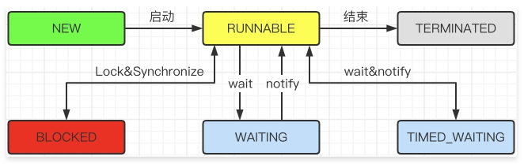

::: tip
这个里面的内容对应 `Java并发编程基础知识` 书籍中的内容。需要的画私聊我哈！！！
:::

## 一、简介
Java内存模型（Java Memory Model，简称JMM）是一种抽象的概念，它定义了Java程序中各个变量（包括实例域、静态域和数组元素）的读写访问方式，以及这些变量如何在多线程环境中被正确地同步和可见。JMM的目标是确保Java程序在各种不同的硬件和操作系统平台上都能保持一致的内存访问效果。

### 1、JMM的基本概念

* **主内存与工作内存**：在JMM中，所有的变量都存储在主内存中，而每个线程都有自己独立的工作内存（也称为本地内存或栈空间）。线程对变量的所有操作（读取、赋值等）都必须在自己的工作内存中进行，不能直接操作主内存中的变量。线程之间的变量值传递需要通过主内存来完成。
* **内存间交互操作**：JMM定义了8个操作来完成主内存和工作内存之间的交互，包括read（读取）、load（载入）、use（使用）、assign（赋值）、store（存储）、write（写入）、lock（锁定）和unlock（解锁）。这些操作必须按照一定的顺序执行，以确保线程之间的内存可见性和有序性。

### 2、JMM的关键特性

* **原子性**：JMM保证了基本数据类型的访问和赋值操作是原子的，但对于64位的数据类型（如long和double），在32位JVM中可能不具备原子性。此外，JMM允许通过synchronized和volatile关键字来保证复合操作的原子性。换句话说，一个操作是不可中断的。即使是在多个线程一起执行的时候，一个操作一旦开始，九不会被其他线程所干扰。
* **可见性**：可见性是指当一个线程修改了某个共享变量的值，其他线程能够立即感知到这个变化。JMM通过volatile关键字和synchronized关键字来保证变量的可见性。
* **有序性**：JMM允许编译器和处理器对指令进行重排序以提高性能，但重排序必须遵守数据的依赖性。通过volatile关键字可以禁止指令重排序，保证程序的有序性。

### 3、JMM的同步机制

* **synchronized**：synchronized关键字可以用于方法或代码块上，它确保了同一时刻只有一个线程可以执行某个方法或代码块，从而实现了对共享变量的互斥访问。
* **volatile**：volatile关键字用于修饰变量，它保证了变量的可见性和有序性（禁止指令重排序），但并不能保证原子性。

## 二、多线程基本操作

### 1、线程的五种状态

- NEW: 表示刚刚创建的线程，这个时候线程还没开始执行。
- RUNABLE: 当调用 `start()` 方法时，处于该状态。表示线程所需的一切资源都已经准备好。
- BLOCKED: 当线程在执行过程中遇到了锁，就会进入该状态。
- WAITING: 处于无时间限制的等待状态。
- TIME_WAITING：处于有限的等待状态。
- TEERMINATED：当线程执行完毕，九进入结束状态。

### 2、interrup/isInterrupt/interrupted

线程中断不会使线程立即退出，而是给线程发送一个通知，告知目标线程，有人希望你退出了！至于目标线程接到通知后如何处理，则是由目标线程自行决定。
完全由目标线程自行决定这一点非常重要，如果正在运行业务过程，接收到通知你要停掉，就突然停掉会造成业务执行的不完整。
jdk 中关于线程中断提供了三个方法：
- interrup(): 中断线程，添加中断状态。
- isInterrupt(): 判断线程是否被中断。
- interrupted(): 判断线程是否被中断，并清楚当前中断状态。

### 3、wait和notify

- 这两个方法使 Object() 类提供的方法，也就是说任何对象都可以调用这两个方法。用于支持多线程之间的协作操作。
- 线程 A 调用了 obj.wait() 方法，那么线程 A 就会停止继续运行，转为等待状态。那么等待何时才能结束呢？即：线程 A 会一直等到其他线程调用了 obj.notify() 方法为止。
- 如果一个线程调用了 obj.wait() 那么它就会进入 obj 对象的等待队列。这个等待队列中，可能会有多个线程，因为系统运行多个线程同时等待某一个对象。当 obj.wait() 被调用时，它就会从这个等待队列中，随机选择一个线程，并将其唤醒。这种选择时不公平的，是完全随机的。

### 4、join 和 yield

当一个线程的输入非常依赖另一个或者多个线程的输出，此时，这个线程就需要等待依赖线程执行完毕，才能继续执行。JDK 提供了 join() 操作来实现这个功能。

## 三、volatile

正常情况下，如果我们不使用 volatile，那么每条线程都会有自己的缓存，当全局变量被修改时，其他线程可能并不会被通知到。

volatile 并不能真正的保证线程安全，它只能确保一个线程修改数据后，其他线程能看到这个改动。