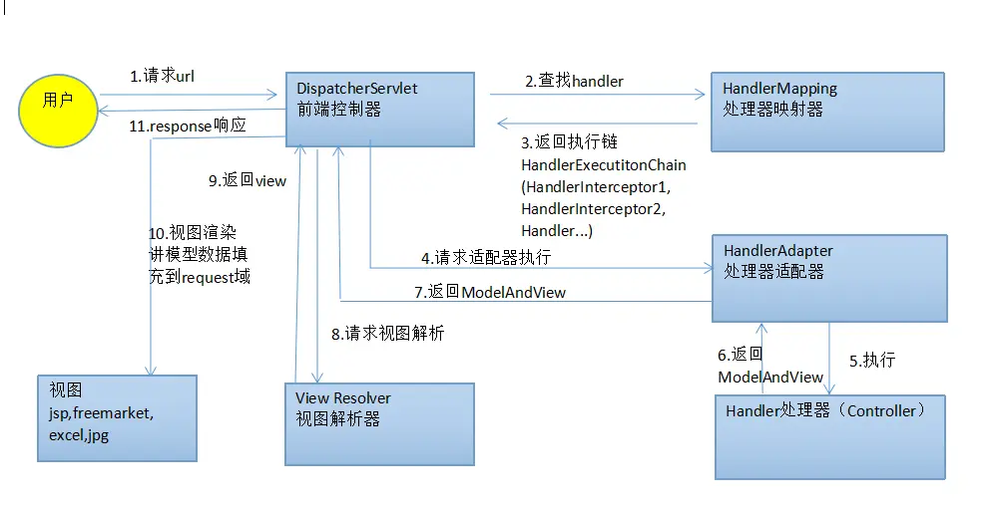

## 一、简介

Spring MVC 是 Spring 框架的一个模块，用于构建 Web 应用程序，它遵循模型 - 视图 - 控制器（MVC）设计模式。

## 二、Spring MVC 的核心组件

1、DispatcherServlet

这是 Spring MVC 的前端控制器，它是整个框架的核心。所有的 HTTP 请求都会先经过它。它负责接收请求，然后将请求分发给相应的处理器（Controller）进行处理。它还负责选择合适的视图来呈现处理结果。

2、Controller

控制器是处理用户请求的组件。它接收来自 DispatcherServlet 的请求，根据请求的内容执行相应的业务逻辑，然后返回一个模型和视图的名称给 DispatcherServlet。例如，一个处理用户登录请求的控制器，会接收用户输入的用户名和密码，验证其正确性，并决定下一步的操作（如登录成功后跳转到主页面，或者登录失败返回错误信息页面）。

3、Model

模型用于封装应用程序的数据和业务逻辑。它通常是一个 Java 对象，包含了数据和相关的操作方法。在处理请求时，Controller 会操作 Model 来获取或更新数据。例如，在一个电子商务应用中，Model 可能包含商品信息、用户订单等数据。

4、View

视图负责将 Model 中的数据呈现给用户。它可以是 JSP、Thymeleaf 等多种视图技术。视图接收 Model 中的数据，并将其渲染成 HTML 页面或其他格式的响应内容，然后返回给客户端。例如，一个商品列表页面的视图会接收 Model 中包含的商品数据，并将其展示在 HTML 页面上。

## 三、Spring MVC 的工作流程

- 用户在浏览器中发送一个 HTTP 请求，请求首先到达 DispatcherServlet。
- DispatcherServlet 根据请求的 URL 等信息，查找合适的 Controller 来处理请求。它通过 HandlerMapping 组件来完成这个查找过程。
- Controller 接收到请求后，执行相应的业务逻辑，通常会与 Model 进行交互，操作数据。例如，Controller 可能会从数据库中获取数据并更新 Model。
- Controller 处理完请求后，返回一个包含模型数据和视图名称的 ModelAndView 对象给 DispatcherServlet。
- DispatcherServlet 根据视图名称，通过 ViewResolver 组件查找并选择合适的视图来渲染结果。
- 视图将 Model 中的数据渲染成 HTML 或其他格式的响应内容，并将其返回给客户端，最终在用户的浏览器中显示。

## 四、Spring MVC 的优势和特点

1、松耦合的架构
- 通过遵循 MVC 模式，将应用程序的不同部分（模型、视图、控制器）分离，使得各部分之间的耦合度降低。例如，视图只负责数据的展示，不包含业务逻辑，而控制器专注于处理用户请求和协调模型与视图之间的交互。这种分离使得代码更易于维护和扩展。当需要修改业务逻辑时，只需要修改控制器的相关代码，而不会影响视图的显示。同样，当需要更改视图的呈现方式时，也不会影响到模型和控制器的代码。
- 支持多种视图技术，如 JSP、Thymeleaf、FreeMarker 等。开发人员可以根据项目需求和个人喜好选择合适的视图技术，而不需要对整个应用程序的架构进行大的改动。这使得应用程序在不同的项目场景下具有更好的适应性。

2、强大的请求处理和数据绑定功能
- Spring MVC 提供了丰富的注解来简化请求处理。例如，`@RequestMapping`注解用于将 URL 映射到控制器的方法上。开发人员可以通过这个注解定义不同的 HTTP 请求方法（GET、POST、PUT、DELETE 等）对应的处理方法。这样，当用户发送不同类型的请求时，系统能够准确地调用相应的方法进行处理。
- 数据绑定功能允许自动将请求参数转换为 Java 对象。例如，当用户在表单中输入数据并提交时，Spring MVC 可以将表单中的数据自动绑定到一个 Java 对象中，方便控制器进行处理。这种数据绑定功能大大减少了手动处理请求参数的代码量，提高了开发效率，并且减少了因手动处理数据可能导致的错误。

3、易于集成和扩展
- 作为 Spring 框架的一部分，Spring MVC 能够与其他 Spring 模块无缝集成。例如，可以方便地与 Spring 的事务管理、数据访问（如 Spring JDBC、Spring Data JPA）等模块集成，实现企业级应用开发中的各种功能。同时，它也可以与其他第三方库和框架进行集成。例如，可以与 JSON 处理库（如 Jackson、Gson）集成，方便地将 Java 对象转换为 JSON 格式的数据进行 API 开发。
- 支持自定义拦截器（Interceptor），可以在请求处理的不同阶段进行拦截和处理。拦截器可以用于实现日志记录、权限验证、性能监控等功能。开发人员可以根据自己的需求编写自定义拦截器，并将其配置到 Spring MVC 应用程序中，实现对请求处理过程的灵活扩展和增强。
