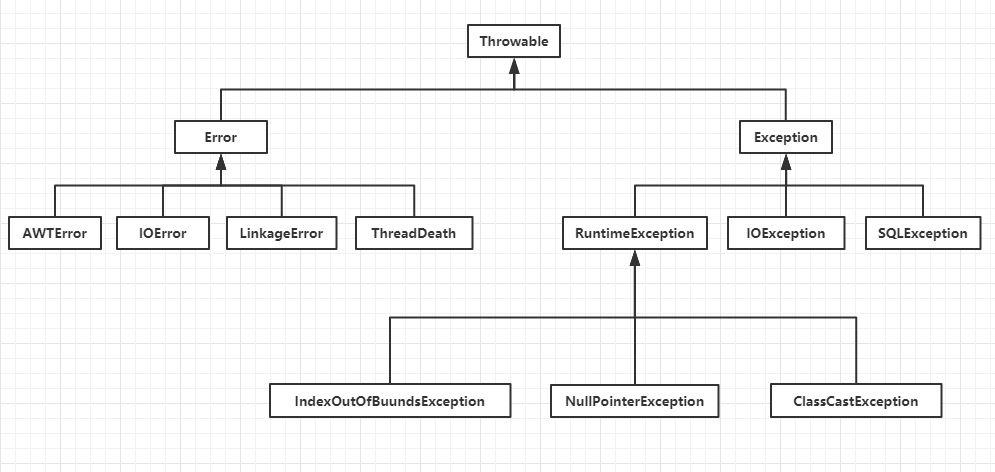

## 一、简介
Java 异常（Exception）是 Java 提供的一种用于处理程序中错误情况的机制。当 Java 程序运行时遇到无法继续执行的情况（如数组越界、空指针引用等），就会抛出（throw）一个异常。异常处理是 Java 编程中非常重要的一部分，它使得程序更加健壮，能够优雅地处理错误情况，而不是直接崩溃。

## 二、异常体系


异常的体系的结构是顶级的类 Throwable，它的子类分为 Error 和 Exception，Error 的错误分为虚拟机错误、内存溢出、线程锁死等。Exception 分为 IoException 和 RuntimeExption。RuntimeExption 又分为 空指针异常、数组下标越界异常、算数异常、类型转换异常等。

## 三、异常分类

Java 中的异常被分为两大类：检查型异常（Checked Exceptions）和非检查型异常（Unchecked Exceptions）。

1. **检查型异常（Checked Exceptions）**：这类异常在编译时就必须被处理，否则编译器会报错。处理这类异常的方式有两种：使用 `try-catch` 语句捕获并处理异常，或者使用 `throws` 关键字声明该方法可能会抛出异常，让方法的调用者来处理。常见的检查型异常有 `IOException`、`SQLException` 等。

2. **非检查型异常（Unchecked Exceptions）**：这类异常包括运行时异常（`RuntimeException` 及其子类）和错误（`Error` 及其子类）。运行时异常在编译时不需要被显式处理，它们通常是由程序逻辑错误引起的，如数组越界、空指针引用等。错误则是由 JVM 抛出的，表示系统级的错误，如 `OutOfMemoryError`、`StackOverflowError` 等，这些错误通常无法被恢复或捕获。

Java 异常（Exception）是 Java 提供的一种用于处理程序中错误情况的机制。当 Java 程序运行时遇到无法继续执行的情况（如数组越界、空指针引用等），就会抛出（throw）一个异常。异常处理是 Java 编程中非常重要的一部分，它使得程序更加健壮，能够优雅地处理错误情况，而不是直接崩溃。

## 四、异常处理机制

Java 提供了 `try-catch-finally` 语句来处理异常。

- **try 块**：用于包裹可能发生异常的代码。
- **catch 块**：用于捕获并处理 try 块中抛出的异常。可以有多个 catch 块来捕获不同类型的异常。
- **finally 块**：无论是否发生异常，finally 块中的代码都会被执行。它通常用于释放资源，如关闭文件流、数据库连接等。

- 示例
```java
try {
    // 尝试执行的代码
    int result = 10 / 0; // 这将抛出 ArithmeticException
} catch (ArithmeticException e) {
    // 处理 ArithmeticException
    System.out.println("发生除数为0的异常");
} finally {
    // 无论是否发生异常，都会执行的代码
    System.out.println("finally 代码块执行");
}
```

## 五、自定义异常

Java 允许开发者通过继承 `Exception` 类或其子类来创建自定义异常。自定义异常通常用于表示程序中特有的错误情况。

```java
public class MyCustomException extends Exception {
    public MyCustomException(String message) {
        super(message);
    }
}

// 使用自定义异常
try {
    throw new MyCustomException("这是一个自定义异常");
} catch (MyCustomException e) {
    System.out.println(e.getMessage());
}
```

通过合理使用异常处理机制，可以使 Java 程序更加健壮和易于维护。