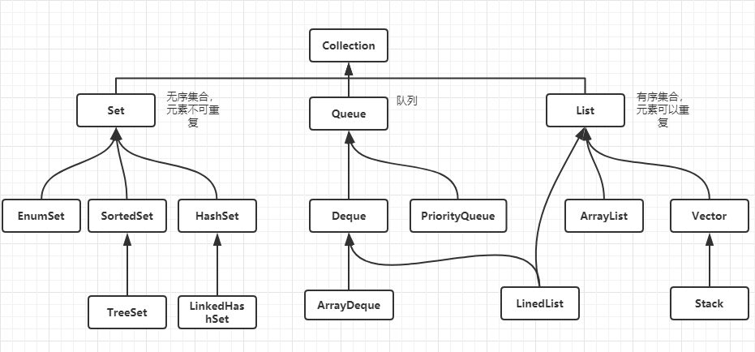
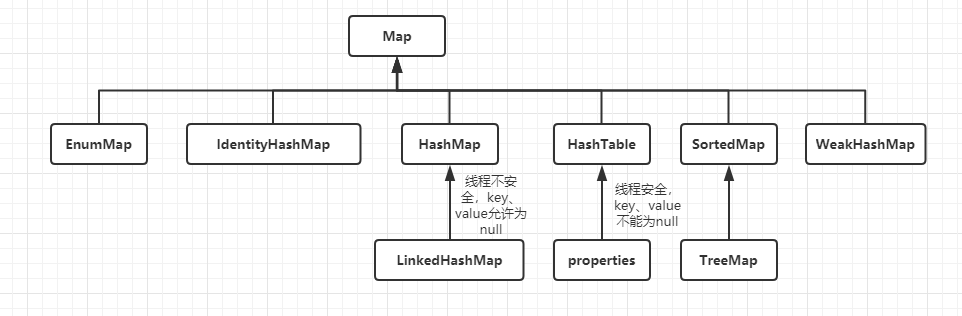

## 一、流程控制

1、概念
```java
    //1.if

    //2.if...else

    //3.if...else if...else...

    //4.switch

    //5.跳出循环体：break和continue
```

2、语法
```java
    //1. if
    if(条件表达式){
        //执行代码块
    }

    //2.if...else
    if(条件表达式){
        //条件表达式为真执行的代码块
    } else {
        //条件表达式为假执行的代码块
    }

    //3.if...else if...else...
    if(条件表达式){
        //条件表达式符合条件执行的代码块
    } else if(条件表达式) {
        //条件表达式符合条件执行的代码块
    } else {
        //默认执行的代码块
    }

    //4.switch
    switch(expression){
        case value :
        //语句
        break; //可选
        case value :
        //语句
        break; //可选
        //你可以有任意数量的case语句
        default : //可选
        //语句
    }
```
3、案例
```java
    public static void main (String[] args) {
        int a = 15;
        //1.if
        if(a<6){
            System.out.println("简单的判断语句");
        }
        //2.if...else...
        if(a<6){
            System.out.println("if...else... 条件表达式为真");
        } else {
            System.out.println("if...else... 条件表达式为假");
        }

        //3.if...else if...else...
        if(a<6){
            System.out.println("if...else if...else... 条件表达式为真");
        } else if(a==6){
            System.out.println("if...else if...else... 条件表达式为假");
        } else {
            System.out.println("默认执行的代码块");
        }

        //4.switch
        int a = 10;

        switch(a){
            case 1:
                System.out.println("得分" + a); 
            break;
            case 2:
                System.out.println("得分" + a); 
            break;
            case 3:
                System.out.println("得分" + a); 
            break;
            case 4:
                System.out.println("得分" + a); 
            break;
            case 5:
                System.out.println("得分" + a); 
            break;
            case 6:
                System.out.println("得分" + a); 
            break;
            default:
                System.out.println("没获取得分"); 
        }
```

## 二、单列集合和双列集合

1、Java 中单列集合的组成方式由下面的方式构成

 
- HashSet 的底层数据结构是哈希表，哈希表主要由 `hashCode()` 和 `equals()` 两个方法保证唯一性的，首先判断 `hashCode()` 的值是否相同，如果相同继续执行 `equals()` 方法，（看返回的结果：如果返回 `true`：不添加，返回 `false`：添加）。如果返回不同，直接存入。
- LinkedHashSet 的底层数据结构是链表和哈希表组成，链表保证元素的有序；哈希表保证元素的唯一性。
- TreeSet 底层数据结构是红黑树。
- ArrayList 底层数据结构是数组，查询速度快，增删慢，但是线程不安全，效率高。数据是有序、可重复。
- Vector 底层数据结构是数组，查询快，增删慢。线程安全、效率低。数据是有序、可重复。
- LinkedList 底层数据结构是链表，查询慢，增删快。存储数据的特点是数据有序、可重复。

2、Java 中双列集合的组成方式由下面的方式构成

 

- Map 双列集合的特点是数据结构只对 key 值有效和值无关。存储的形式是以 `键值` 对的形式存储元素的，`键` 是唯一的，`值` 可能会重复。
- HashMap 底层数据结构是哈希表，线程不安全、效率高。哈希表主要依赖的两个方法：`hashCode()` 和 `equals()` 执行的顺序是首先判断 `hashCode()` 值是否相同。如果相同继续执行 `equals()` 然后再看返回结果, 如果返回 true 说明元素重复，不添加；如果返回 false 就直接添加到集合.
- LinkedHashMap 底层数据结构是链表和哈希表组成，链表保证元素的有序；哈希表保证数据的唯一性。
- Hashtable 底层数据结构是哈希表，线程安全，效率低。
- TreeMap  底层数据结构是红黑树。

## 三、声明数组
```java
//数组：
    //语法：
        type [] arrayName;
        或者
        type arrayName [];
    //初始化：
        //静态初始化：
            //方式1
            int [] arr = new int[]{5, 6, 7, 8, 9};
            System.out.println(arr[1]);

            //方式2
            int [] arrName = {1, 2, 3, 4, 6};
        //动态初始化:
            int [] arrs = new int[5];
    //存值&获取值：
        //获取值
            arrayName[索引位置]
        //存值
            arrayName[索引位置] = 值;
//循环
    // 1.while
        while( 布尔表达式 ) {
            //循环内容
        }

    //2.do...while...
        //循环至少执行一次
        do {
            //循环内容
        } while(条件表达式);

    //3.普通for循环
        for(初始化; 布尔表达式; 更新) {
            //执行代码块
        }

    //4.增强for
        for(声明语句 : 表达式) {
            //执行代码块
        }
    
```

## 四、容器的声明和遍历

```java
    //HashSet
        package com.tsing.extend.demo9;

        import java.util.HashSet;

        public class DemoHashSet {
            
            public static void main(String[] args) {

                HashSet<String> hs = new HashSet<String>();
                //add
                hs.add("测试1");
                hs.add("测试1");
                hs.add("测试2");
                hs.add("测试3");
                
                //delete
                hs.remove("测试2");
                
                //update
                //这个需要配合查询需要删除的元素，然后执行删除操作，最后将新的数据添加进去。
                
                //search
                for (String str : hs) {
                    System.out.println(str);
                }
            }
        }

    //TreeSet
        package com.tsing.extend.demo9;

        import java.util.TreeSet;

        public class DemoTreeSet {

            public static void main(String[] args) {
                
                TreeSet<String> ts = new TreeSet<String>();
                
                //add
                ts.add("ceshi1");
                ts.add("ceshi2");
                ts.add("ceshi3");
                ts.add("ceshi3");
                ts.add("ceshi4");
                
                //delete
                ts.remove("ceshi4");
                
                //update
                    //这个需要配合查询需要删除的元素，然后执行删除操作，最后将新的数据添加进去。
                
                //search
                for (String str : ts) {
                    System.out.println(str);
                }
                
            }

        }

    //ArrayList
        package com.tsing.extend.demo9;
        import java.util.ArrayList;

        public class DemoArrayList {
            
            public static void main(String[] args) {
                
                ArrayList<String> al = new ArrayList<String>();
                
                //add
                al.add("ceshi1");
                al.add("ceshi2");
                al.add("ceshi3");
                al.add("ceshi3");
                al.add("ceshi4");
                
                //delete
                al.remove("ceshi1");
                al.remove(2);//根据索引删除
                
                //update
                    //这个需要配合查询需要删除的元素，然后执行删除操作，最后将新的数据添加进去。
                
                //search
                for (String str : al) {
                    System.out.println(str);
                }
                
            }

        }

    //Vector
        package com.tsing.extend.demo9;

        import java.util.Vector;

        public class DemoVector {
            
            public static void main(String[] args) {
                Vector<String> v = new Vector<String>();
                
                //add
                v.add("ceshi1");
                v.add("ceshi2");
                v.add("ceshi3");
                v.add("ceshi4");
                v.add("ceshi4");
                
                //delete
                v.remove("ceshi1");
                v.remove(3);//根据索引删除数据
                
                //update
                //这个需要配合查询需要删除的元素，然后执行删除操作，最后将新的数据添加进去。
                
                //search
                
                for (String str : v) {
                    System.out.println(str);
                }
            }
        }

    //LinkedList
        package com.tsing.extend.demo9;

        import java.util.LinkedList;

        public class DemoLinkedList {
            
            public static void main(String[] args) {

                LinkedList<String> ll = new LinkedList<String>();
                
                //add
                ll.add("ceshi1");
                ll.add("ceshi2");
                ll.add("ceshi3");
                ll.add("ceshi4");
                ll.add("ceshi5");
                
                //delete
                ll.remove(0);
                ll.remove("ceshi5");
                
                //update
                ll.set(2, "测试2");
                
                //search
                for (String str : ll) {
                    System.out.println(str);
                }
            }
        }

    //HashMap
        package com.tsing.extend.demo9;

        import java.util.HashMap;
        import java.util.Map;
        import java.util.Set;

        public class DemoHashMap {
            
            public static void main(String[] args) {
                HashMap<String,String> map = new HashMap<String, String>();
                
                //add
                map.put("1", "值1");
                map.put("2", "值2");
                map.put("3", "值3");
                map.put("4", "值4"); //这个覆盖掉
                map.put("4", "值5"); 
                
                //delete
                map.remove("1");
                
                //update
                map.put("2", "修改后的值2");
                
                //search
                Set<Map.Entry<String,String>> en = map.entrySet();
                for (Map.Entry<String, String> entry : en) {
                    System.out.println("key: " + entry.getKey() + " value: " + entry.getValue());
                }
                
            }

        }

    //HashTable
        package com.tsing.extend.demo9;

        import java.util.Hashtable;
        import java.util.Map;
        import java.util.Set;

        public class DemoHashtable {
            
            public static void main(String[] args) {
                
                Hashtable<String, String> hb = new Hashtable<String, String>();
                
                //add
                hb.put("1", "值1");
                hb.put("2", "值2");
                hb.put("3", "值3");
                hb.put("4", "值4"); //这个覆盖掉
                hb.put("4", "值5"); 
                
                //delete
                hb.remove("1");
                
                //update
                hb.put("2", "修改后的值2");
                
                //search
                    Set<Map.Entry<String,String>> en = hb.entrySet();
                    for (Map.Entry<String, String> entry : en) {
                        System.out.println("key: " + entry.getKey() + " value: " + entry.getValue());
                    }
            }

        }

    //TreeMap
    package com.tsing.extend.demo9;

    import java.util.Map;
    import java.util.Set;
    import java.util.TreeMap;

    public class DemoTreeMap {
        
        public static void main(String[] args) {
            TreeMap<String, String> tm = new TreeMap<String, String>();
            
            //add
                tm.put("1", "值1");
                tm.put("2", "值2");
                tm.put("3", "值3");
                tm.put("4", "值4"); //这个覆盖掉
                tm.put("4", "值5"); 
                    
            //delete
                tm.remove("1");
                    
            //update
                tm.put("2", "修改后的值2");
                    
            //search
                Set<Map.Entry<String,String>> en = tm.entrySet();
                    for (Map.Entry<String, String> entry : en) {
                        System.out.println("key: " + entry.getKey() + " value: " + entry.getValue());
                    } 
        }
    }

    //循环
        //1.while
            public static void main (String[] args) {
                int x = 10;
                while(x < 20) {
                    System.out.print("value of x : " + x );
                        x++;
                    System.out.print("\n");
                }
            }
        //2.do...while...
            public static void main (String[] args) {
                int x = 10;
                do{
                    System.out.print("value of x : " + x );
                        x++;
                    System.out.print("\n");
                } while (x < 12);
            }

        //3.for
            public static void main (String[] args) {
                for(int i = 0; i <= 10; i++){
                    System.out.println("执行了第" + i + "次");
                }
            }

        //4.增强for
            public static void main (String[] args) {
                String[] names = { "李栋", "王彦舒", "老子恨你" };
                for( String name : names ) {
                    System.out.println(name);
                };
            }
```
