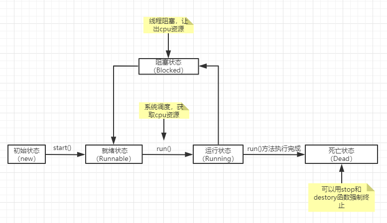

多线程是一种编程概念，它允许多个执行路径（线程）在同一进程内并发运行。

## 一、多线程的概念和作用
1、概念
- 线程是程序执行的最小单元，一个进程可以包含多个线程。每个线程都有自己的程序计数器、栈和局部变量，但它们共享进程的内存空间和其他资源（如打开的文件、网络连接等）。
- 多线程就是在一个程序中同时运行多个线程，每个线程可以执行不同的任务或相同任务的不同部分。

2、作用
- 提高程序性能：通过将一个大任务分解成多个小任务并在不同线程中并行执行，可以充分利用多核处理器的优势，减少程序的执行时间。例如，在图像编辑软件中，可以使用一个线程来处理用户界面的交互，另一个线程用于后台的图像渲染，从而提高整体的响应速度。

- 增强程序的响应能力：在一些需要与用户进行实时交互的应用中，多线程可以确保即使在执行耗时操作时，程序仍然能够及时响应用户的输入。比如在网页浏览器中，一个线程可以用于加载网页内容，而另一个线程可以处理用户的鼠标点击和滚动操作，这样用户不会感觉到界面卡顿。

- 实现异步操作：多线程使得程序可以在后台执行某些操作，而不阻塞主线程的执行。例如，在文件下载程序中，启动一个新线程来下载文件，主线程可以继续显示下载进度或执行其他任务，当下载完成后，再进行相应的处理。

3、线程和进程
- 线程：一个进程中可以有多个线程，如看视频的同时可以听声音，看图像，看弹幕等等。
- 进程: 操作系统中运行的程序就是进程，比如QQ、播放器、游戏、IDE等等。

## 二、实现多线程的方式
### 1、继承 Thread 类

定义一个类继承自Thread类，然后重写run方法，在run方法中编写线程要执行的任务代码。

```java
public class MyThread extends Thread {
    @Override
    public void run() {
        System.out.println("This is a new thread.");
    }
}
```

启动线程

```java
public class Main {
    public static void main(String[] args) {
        MyThread myThread = new MyThread();
        myThread.start();
    }
}
```

当调用start方法时，Java 虚拟机会自动调用该线程的run方法来执行线程的任务。

### 2、实现Runnable接口

定义一个类实现Runnable接口，并实现run方法：

```java
public class MyRunnable implements Runnable {
    @Override
    public void run() {
        System.out.println("This is a thread implemented by Runnable.");
    }
}
```

启动线程
```java
public class Main {
    public static void main(String[] args) {
        MyRunnable myRunnable = new MyRunnable();
        Thread thread = new Thread(myRunnable);
        thread.start();
    }
}
```

这种方式更加灵活，因为 Java 不支持多继承，如果一个类已经继承了其他类，就不能再继承Thread类了，此时可以采用实现Runnable接口的方式来创建线程。

### 3、实现 Callable 接口

在 Java 中，Callable接口是一种用于创建可以返回结果并且可能抛出异常的任务的方式。它与Runnable接口类似，但Callable可以返回结果，而Runnable的run方法没有返回值。

定义一个实现Callable接口的类
```java
import java.util.concurrent.Callable;

public class MyCallable implements Callable<String> {
    @Override
    public String call() throws Exception {
        // 这里编写具体的任务代码，此示例中模拟一个耗时操作后返回结果
        Thread.sleep(2000);
        return "Callable 任务执行完成并返回结果";
    }
}
```

在主线程中使用Callable
```java
import java.util.concurrent.ExecutionException;
import java.util.concurrent.ExecutorService;
import java.util.concurrent.Executors;
import java.util.concurrent.Future;

public class Main {
    public static void main(String[] args) {
        // 创建一个线程池
        ExecutorService executorService = Executors.newSingleThreadExecutor();

        // 提交 Callable 任务到线程池并获取 Future 对象
        Future<String> future = executorService.submit(new MyCallable());

        try {
            // 从 Future 对象获取 Callable 任务的结果，如果任务未完成，此方法会阻塞直到任务完成
            String result = future.get();
            System.out.println(result);
        } catch (InterruptedException | ExecutionException e) {
            e.printStackTrace();
        }

        // 关闭线程池
        executorService.shutdown();
    }
}
```

在上述代码中：
- 首先定义了MyCallable类实现Callable接口，并重写call方法来执行具体的任务，这里模拟了一个耗时操作（通过Thread.sleep）后返回一个字符串结果。
- 在main方法中，创建了一个单线程的线程池ExecutorService，通过submit方法将MyCallable任务提交到线程池中执行，submit方法会返回一个Future对象，这个对象可以用来获取任务的执行结果。然后通过future.get方法获取任务的结果，如果任务还未完成，get方法会阻塞当前线程直到任务完成。最后关闭线程池。

使用Callable接口可以方便地在多线程环境中执行有返回值的任务，并且可以通过Future对象来管理任务的执行状态和结果。这在需要执行一些耗时的计算并获取结果的场景中非常有用，比如在网络请求、数据库查询等操作中。

## 三、线程的五种状态

线程存在五种状态分别是：创建状态、就绪状态、阻塞状态、死亡状态、运行状态。



## 四、多线程的优点和挑战
1、优点

- 资源共享：由于线程共享进程的内存空间，它们可以方便地共享数据和资源。这使得在多个线程之间传递信息和协作变得相对容易。例如，多个线程可以同时访问和修改同一个数组，而不需要进行复杂的数据传递和复制操作。
- 提高效率：如前面提到的，多线程能够充分利用多核处理器的优势，将任务并行执行，从而提高程序的整体效率。特别是对于计算密集型和 I/O 密集型任务，多线程可以显著减少执行时间。
- 简化程序结构：对于一些复杂的应用程序，将任务分解为多个线程可以使程序的结构更加清晰和易于维护。每个线程可以专注于执行一个特定的子任务，使得代码的逻辑更加模块化。

2、挑战
- 线程安全问题：当多个线程同时访问和修改共享数据时，可能会导致数据不一致或程序错误。例如，两个线程同时对一个计数器进行递增操作，如果不采取适当的同步措施，可能会导致计数器的值不准确。常见的解决方法包括使用synchronized关键字、Lock接口等进行线程同步。
- 死锁：在多线程编程中，如果多个线程相互等待对方持有的资源，就会导致死锁。例如，线程 A 持有资源 X 并等待资源 Y，而线程 B 持有资源 Y 并等待资源 X，这时两个线程都无法继续执行，程序就会陷入死锁状态。避免死锁需要合理的资源分配策略和线程同步设计。
- 线程调度复杂性：操作系统负责线程的调度，决定哪个线程何时可以执行。然而，线程的调度是不可预测的，这可能导致程序的执行顺序不确定。例如，在一个多线程的游戏程序中，如果线程调度导致游戏逻辑的执行顺序不一致，可能会出现画面闪烁或游戏状态异常等问题。这就需要程序员在编写多线程程序时，充分考虑到各种可能的执行顺序，并进行适当的处理。


## TODO: 未解决的问题
- 线程的方法：
    - 停止线程
    - 休眠线程
    - 礼让线程
    - 合并线程
- 线程优先级：
- 守护进程：
- 线程同步：
- 同步方法：
    - synchronized
- 死锁：
- Lock锁：
- 生产者和消费者：
    - 解决方式：
        - 利用缓冲去解决：管道法
        - 信号灯法：标志位
- 线程池：