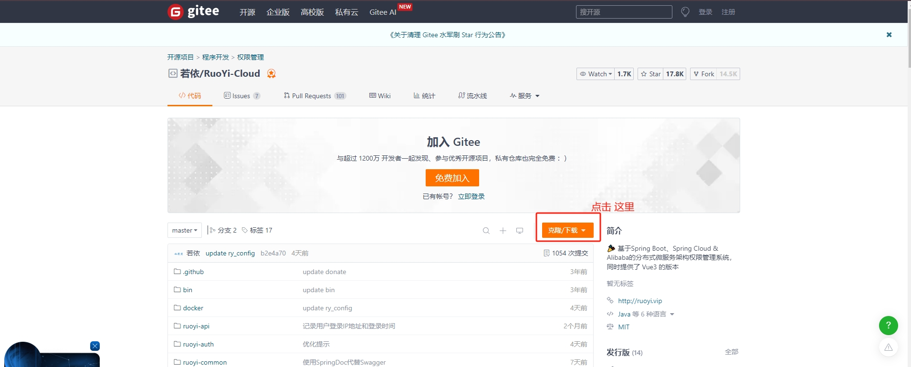
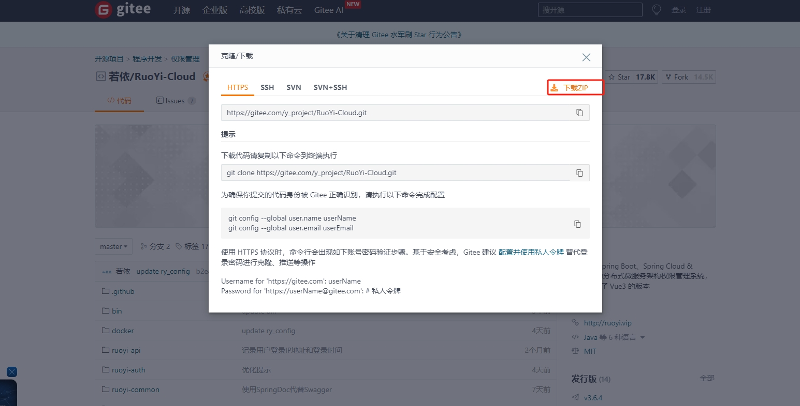
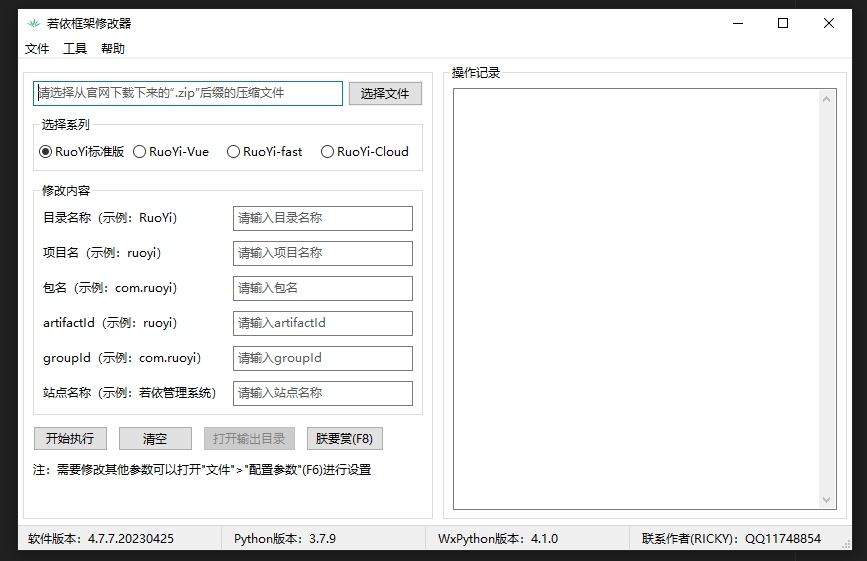

## 一、下载源码

- 1、打开下载连接：`https://gitee.com/y_project/RuoYi-Cloud`
- 2、这里要用我这种方式下载偶，不然后面操作比较麻烦

- 3、点击下载 `zip` 的包

## 二、下载重命名的工具
[点击下载 window若依框架修改器](./若依框架修改器.exe)

- 1、打开修改器

- 2、点击 `选择文件` 的按钮 选择修改的修改的系列。根据提示修改内容。点击开始执行即可。

