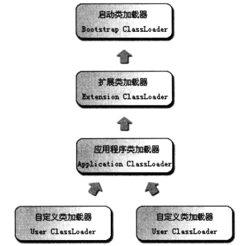

## 一、启动类加载器、扩展类加载器、应用类加载器

| 类加载器| 所属包| 描述|
| --- |--- |--- |
|  启动类加载器  | JDK安装目录下lib目录 |  |
|  扩展类加载器  | JDK安装目录下lib/ext目录 |  |
|  应用类加载器  | 程序员自己写的代码 |  |
|  自定义类加载器  |  |  |

##### 手写自定义类加载器
- MyClassLoader类
```java
public class MyClassLoader extends ClassLoader{

    private String byteCodePath;

    public MyClassLoader(String byteCodePath) {
        this.byteCodePath = byteCodePath;
    }

    public MyClassLoader(ClassLoader parent, String byteCodePath) {
        super(parent);
        this.byteCodePath = byteCodePath;
    }

    @Override
    protected Class<?> findClass(String className) throws ClassNotFoundException {
        String fileName = byteCodePath + className + ".class";
        BufferedInputStream bufferedInputStream = null;
        ByteArrayOutputStream byteArrayOutputStream = new ByteArrayOutputStream();
        
        try {
            bufferedInputStream = new BufferedInputStream(new FileInputStream(fileName));
        } catch (FileNotFoundException e) {
            e.printStackTrace();
        }

        try {
            int len;
            byte[] data = new byte[1024];
            while ((len = bufferedInputStream.read(data)) != -1){
                byteArrayOutputStream.write(data, 0, len);
            }
            byte[] bytes = byteArrayOutputStream.toByteArray();
            return defineClass(null, bytes, 0, bytes.length);
        }catch (Exception e) {
            try {
                bufferedInputStream.close();
                byteArrayOutputStream.close();
            } catch (IOException ioException) {
                ioException.printStackTrace();
            }
        }
        return null;
    }
}
```
- 测试类
```java
public class MyClassLoaderTest {
    public static void main(String[] args) {
        MyClassLoader myClassLoader = new MyClassLoader("C:\\tsing\\");
        try {
            Class<?> person = myClassLoader.loadClass("Person");
            System.out.println(person.getClassLoader()); //com.tsing.jvm.classloader.MyClassLoader@6d6f6e28
            System.out.println(person.getClassLoader().getParent()); //sun.misc.Launcher$AppClassLoader@18b4aac2
        } catch (ClassNotFoundException e) {
            e.printStackTrace();
        }
    }
}
```

- 重点
  - 1、需要继承`ClassLoader`
  - 2、重写`findClass`方法
  - 3、调用`defineClass`方法


##### 双亲委派模型
- 说明
  - 1、`自定义类加载器`先不加载，它会去询问`应用程序类加载器`是否可以加载。
  - 2、`应用程序类加载器`也不会加载，它会去询问`扩展类加载器`是否可以加载。
  - 3、`扩展类加载器`也不会加载，它会去询问`启动类加载器`。
  - 4、如果`启动类加载器`可以加载，就直接加载，不能加载推给`扩展类加载器`。
  - 5、如果`扩展类加载器`可以加载，就直接加载，不能加载推给`应用类加载器`。
  - 6、如果`应用类加载器`可以加载，就直接加载，不能加载推给`自定义类加载器`。
  - 7、如果`自定义类加载器`可以加载，就直接加载，不能加载就会报`classNotFound`异常。

