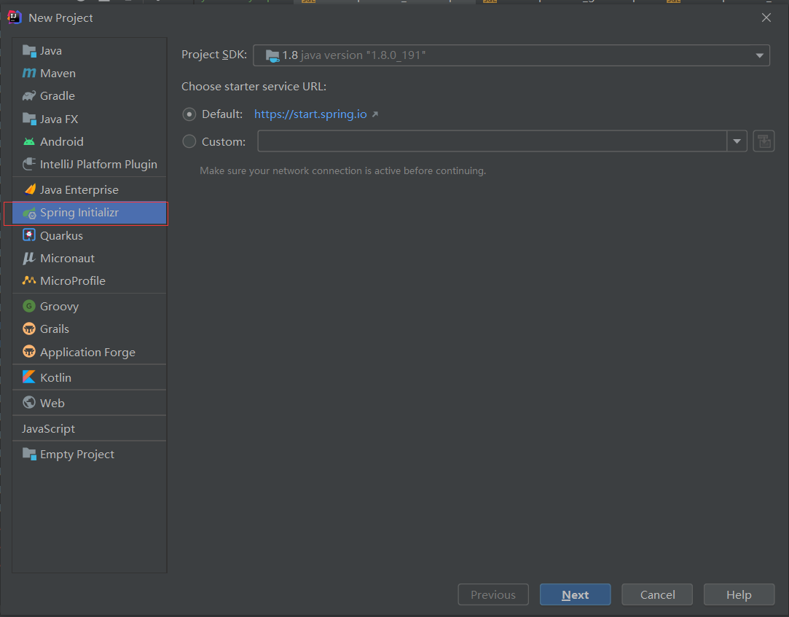
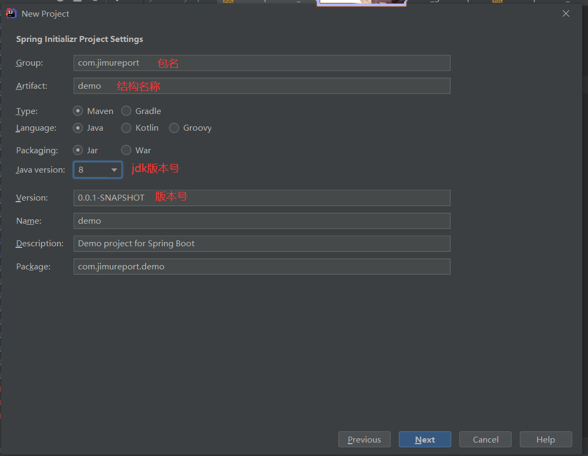

## 一、项目简介

积木报表（JimuReport）是一款功能强大且易于使用的企业级Web报表工具，官网文档地址：`https://help.jeecg.com/`，它以其直观的用户界面、丰富的图表类型和强大的数据整合能力而受到广泛欢迎。以下是对积木报表的详细介绍：

1、产品特点
数据可视化：积木报表能够将复杂的数据以图形化的方式展示出来，如柱状图、折线图、饼图、雷达图、散点图、词云图等多种图表类型，帮助用户更直观地理解数据。
拖拽设计：其Web版报表设计器类似于Excel操作风格，用户可以通过拖拽的方式轻松完成报表设计，极大地降低了报表开发的难度和周期。
数据源整合：积木报表支持从多个数据源（如SQL数据库、API等）获取数据，并自动进行格式转换和校验，确保数据的准确性和一致性。
自动化任务：用户可以设置自动化任务，根据指定的时间和频率自动生成报表，节省时间和减少人工操作。
数据安全：积木报表采用先进的数据加密技术和权限管理机制，保护企业数据的安全性和机密性。

2、应用场景
积木报表广泛应用于各行各业，包括但不限于财务管理、销售分析、市场调研、生产管理等领域。它可以帮助企业快速制作各种类型的报表，如财务报表、销售报表、库存报表等，并支持大屏展示，满足企业不同层级的报表需求。

3、优势与特点
永久免费：积木报表是一款永久免费的报表工具，支持商用，降低了企业的使用成本。
低代码：随着低代码概念的兴起，积木报表实现了完全在线设计，降低了报表制作的门槛，使得非技术人员也能轻松上手。
智能分析：积木报表不仅支持数据的可视化展示，还具备深入的数据分析能力，帮助企业更好地理解和应对业务挑战。
灵活定制：用户可以根据自己的需求自定义公式和计算字段，满足不同的报表需求。同时，积木报表还支持将报表数据导出为Excel、PDF等常见格式，方便与他人共享和存档。
四、版本与更新
积木报表自研发以来，不断迭代更新，功能日益完善。目前，积木报表已经发布了多个版本，每个版本都带来了新的功能和优化。用户可以通过官方网站或相关渠道获取最新版本的信息和更新日志。

综上所述，积木报表是一款功能强大、易于使用且免费的企业级Web报表工具，它以其丰富的图表类型、拖拽设计、数据源整合、自动化任务和数据安全等特点，赢得了广大用户的青睐。

## 二、创建 SpringBoot 项目 

NEW --> Project --> Spring Initializr

注意设置自己的 JDK 版本




## 三、添加积木项目依赖 pom.xml

```java
<?xml version="1.0" encoding="UTF-8"?>
<project xmlns="http://maven.apache.org/POM/4.0.0" xmlns:xsi="http://www.w3.org/2001/XMLSchema-instance"
	xsi:schemaLocation="http://maven.apache.org/POM/4.0.0 https://maven.apache.org/xsd/maven-4.0.0.xsd">
	<modelVersion>4.0.0</modelVersion>
	<parent>
		<groupId>org.springframework.boot</groupId>
		<artifactId>spring-boot-starter-parent</artifactId>
		<version>3.3.3</version>
		<relativePath/> <!-- lookup parent from repository -->
	</parent>
	<groupId>com.example</groupId>
	<artifactId>springboot-jeecgboot</artifactId>
	<version>0.0.1-SNAPSHOT</version>
	<name>springboot-jeecgboot</name>
	<description>springboot-jeecgboot</description>
	<url/>
	<licenses>
		<license/>
	</licenses>
	<developers>
		<developer/>
	</developers>
	<scm>
		<connection/>
		<developerConnection/>
		<tag/>
		<url/>
	</scm>
	<properties>
		<java.version>17</java.version>
	</properties>
	<dependencies>
		<dependency>
			<groupId>org.springframework.boot</groupId>
			<artifactId>spring-boot-starter-web</artifactId>
		</dependency>

		<dependency>
			<groupId>org.springframework.boot</groupId>
			<artifactId>spring-boot-starter-test</artifactId>
			<scope>test</scope>
		</dependency>

		<dependency>
			<groupId>org.jeecgframework.jimureport</groupId>
			<artifactId>jimureport-spring-boot3-starter-fastjson2</artifactId>
			<version>1.7.8</version>
		</dependency>

		<dependency>
			<groupId>mysql</groupId>
			<artifactId>mysql-connector-java</artifactId>
			<version>8.0.31</version>
		</dependency>

	</dependencies>

	<build>
		<plugins>
			<plugin>
				<groupId>org.springframework.boot</groupId>
				<artifactId>spring-boot-maven-plugin</artifactId>
			</plugin>
		</plugins>
	</build>

</project>
```

## 四、application.yml 核心配置文件

```java
spring:
  application:
    name: springboot-jeecgboot
  datasource:
    url: jdbc:mysql://localhost:3306/a_springboot_jeecgboot
    username: root
    password: 123456
    driver-class-name: com.mysql.cj.jdbc.Driver
```

## 五、创建数据库，导入数据到数据库中
[数据库SQL文件 jimureport.mysql5.7.create.sql](./jimureport.mysql5.7.create.sql)

## 六、核心启动类配置需要扫描的包

```java
package com.example.springbootjeecgboot;

import org.springframework.boot.SpringApplication;
import org.springframework.boot.autoconfigure.SpringBootApplication;

// 配置扫描的包
@SpringBootApplication(scanBasePackages = {"org.jeecg.modules.jmreport","com.jimureport.demo"})
public class SpringbootJeecgbootApplication {

	public static void main(String[] args) {
		SpringApplication.run(SpringbootJeecgbootApplication.class, args);
	}

}
```

## 七、启动项目

运行 `SpringbootJeecgbootApplication` 类中的 `main` 方法。

## 八、访问项目

`http://127.0.0.1:8080/jmreport/list`