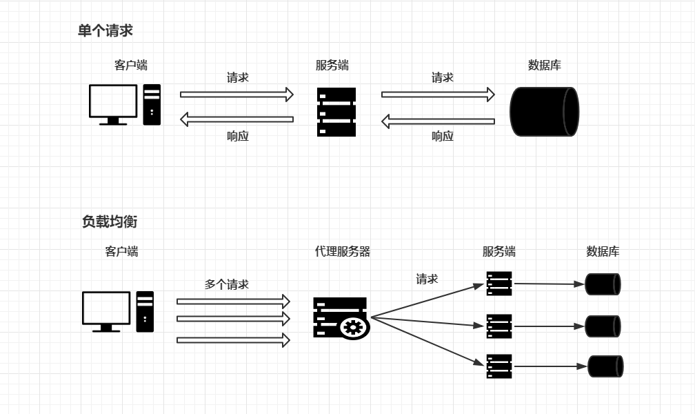
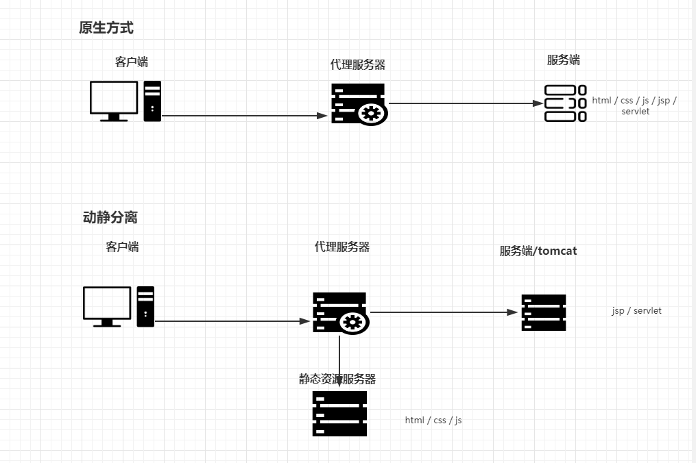

## 一、简介

Nginx (engine x) 是一个高性能的 HTTP 和反向代理服务器，也是一个 IMAP/POP3/SMTP 代理服务器。由俄罗斯程序员 Igor Sysoev 开发，并在2004年首次公开发布。Nginx 以其高并发处理能力、低内存消耗、稳定性、丰富的功能集、简单的配置以及低学习曲线而广受欢迎。Nginx 通常被用作 Web 服务器来托管网站，但也可以有效地用作反向代理、负载均衡器和 HTTP 缓存。

## 二、Nginx 的主要特点

1、**高性能**：Nginx 采用了异步非阻塞的事件驱动模型，这使得它能够处理数以万计的并发连接，而无需为每个请求创建新的进程或线程。

2、**稳定性**：Nginx 的设计使其能够在高负载下保持稳定的性能，减少了崩溃和重启的需要。

3、**丰富的功能集**：除了基本的 HTTP 服务器功能外，Nginx 还支持 HTTPS、SSL/TLS、gzip 压缩、虚拟主机、URL 重写、负载均衡、缓存、HTTP/2 支持等。

4、**配置简单**：Nginx 的配置文件简洁明了，易于学习和使用。配置文件采用指令块的形式，支持丰富的变量和条件判断。

5、**模块化设计**：Nginx 的许多功能都是通过模块实现的，这些模块可以动态地加载和卸载，从而提供了高度的灵活性和可扩展性。

6、**低内存消耗**：Nginx 的内存占用非常低，这使得它能够在资源受限的环境中高效运行。

7、**热部署**：Nginx 支持在不中断服务的情况下升级和重新加载配置，这对于需要高可用性的生产环境尤为重要。

## 三、Nginx 的应用场景

- **静态文件服务器**：用于托管静态文件（如 HTML、CSS、JavaScript、图片等）。
- **反向代理**：作为后端服务器（如 Apache、Tomcat）的前端，接收客户端请求并转发给后端服务器，同时提供负载均衡和缓存功能。
- **负载均衡器**：将客户端请求分发到多个后端服务器上，以平衡负载并提高系统的整体性能。
- **HTTP 缓存**：缓存静态内容以减少后端服务器的负载和响应时间。
- **邮件代理服务器**：作为 IMAP/POP3/SMTP 代理服务器，处理电子邮件的收发。

## 四、正向代理和反向代理

1、正向代理
如果用户直接访问谷歌服务器是访问不通的，如果想要访问到谷歌服务器需要加一台正向代理服务器，然后在客户端（浏览器）中配置代理服务器就行了。

2、反向代理
客户端对代理服务器是无感知的，因为客户端不用任何配置就可以访问，只用将请求发送到反向代理服务器上，由反向代理服务器去选择目标服务器，获取数据后，再返回给客户端用，此时，反向代理服务器和目标服务器对外就是一台服务器，暴露的是代理服务器的地址，隐藏了真实服务器的地址。

## 五、负载均衡

客户端将多个请求发送到服务器，服务器处理请求，有一些可能要与数据库交互服务器处理完成后，再将结果返回给客户端。如果所有的请求都在一台服务器上访问，效率会大大的降低，这个时候就用 `负载均衡` 将多个请求通过代理服务器转发给不同的服务器上。效率会提升。

## 六、动静分离

为了加快网站的解析速度，可以把动态的页面和静态的页面由不同的服务器解析，加快速度，降低原来单个服务器的压力。

