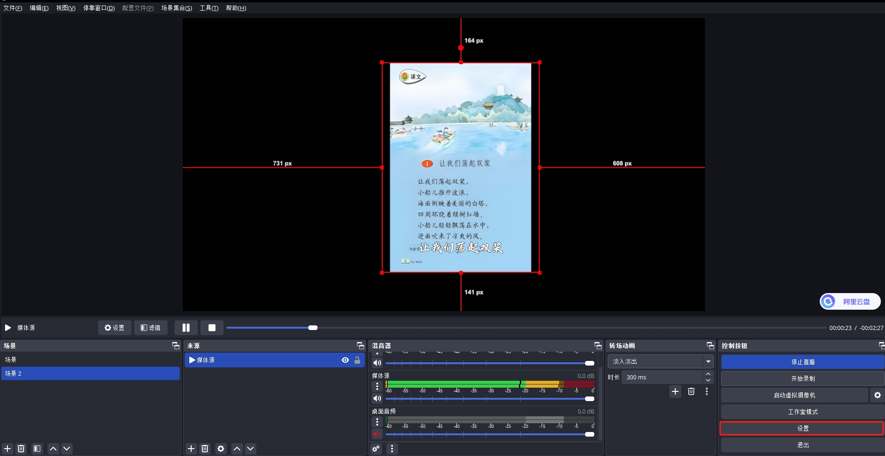
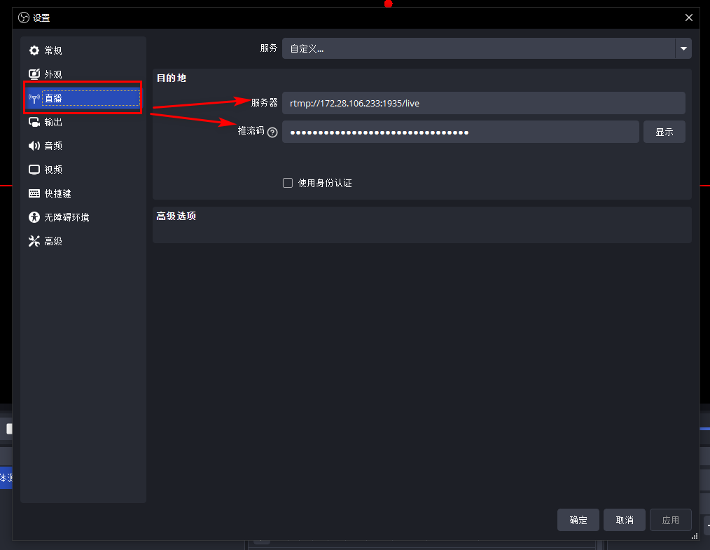
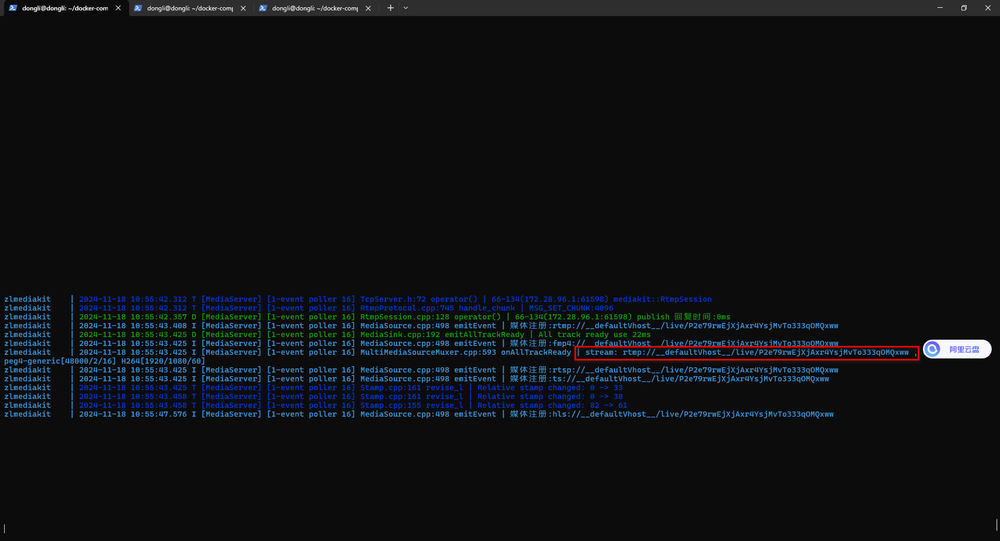
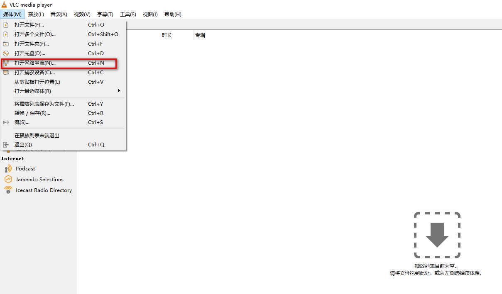
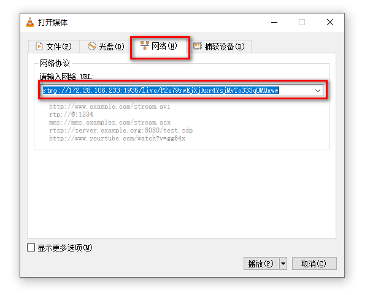

## 一、介绍所需工具 OBS Studio、ZLMediaKit、WVP-PRO

### OBS Studio

OBS Studio（Open Broadcaster Software Studio）是一款开源的实时流媒体和屏幕录制软件，广泛用于内容创作者、游戏玩家、教师、会议主持人等需要进行屏幕录制和直播的用户。其特点包括：

1. **多平台支持**：支持Windows、macOS和Linux操作系统。
2. **多种输入源**：支持屏幕捕捉、窗口捕捉、视频捕捉设备（如摄像头）、音频输入捕捉、图像、文本、浏览器窗口等多种输入源。
3. **多场景切换**：允许用户设置多个场景，并在录制或直播过程中轻松切换。每个场景可以包含不同的布局、媒体源和效果。
4. **高级设置**：提供多种视频和音频设置，包括分辨率、帧率、比特率、编码器等，以满足不同质量和性能需求。
5. **插件支持**：支持通过插件扩展功能，用户可以安装各种插件来增加额外功能，如虚拟背景、特效滤镜等。
6. **实时预览**：在开始录制或直播前，可以实时预览场景和设置，确保一切正常。

OBS Studio以其强大的功能和免费开源的特性，成为了众多用户进行屏幕录制和直播的首选工具。

### ZLMediaKit

ZLMediaKit是一个基于C++开发的开源流媒体服务器，提供了高性能的音视频处理能力。其主要特点包括：

1. **支持多种协议**：支持常见的流媒体协议，如RTSP、RTMP、HLS、HTTP-FLV等，并且具有低延迟和高并发处理能力。
2. **高性能**：使用多路复用/多线程/异步网络IO模式开发，并发性能优越，支持海量客户端连接。
3. **跨平台**：支持Linux、macOS、iOS、Android、Windows全平台。
4. **完善的API**：提供完善的标准C API，可以作SDK用，或供其他语言调用。同时，提供完整的MediaServer服务器，可以免开发直接部署为商用服务器。
5. **HTTP API管理**：提供了通过HTTP协议访问的接口，用于控制和管理ZLMediaKit流媒体服务器的功能和状态。

ZLMediaKit以其功能强大、高性能和开源的特性，适用于构建实时音视频传输和处理的应用，如直播、视频会议、视频监控等。

### WVP-PRO

WVP-PRO是一款强大的流媒体平台，支持多种协议，适用于政府监控系统和各种需要实时监控的场景，如养鸡场监控。其特点包括：

1. **多种协议支持**：支持28181、RTSP、RTMP、FLV等多种协议，可实现视频流发送到其他平台。
2. **用户友好的界面**：提供了集成化的Web界面，方便用户进行各种操作和管理。
3. **良好的兼容性**：兼容各种设备，支持电子地图，可接入不同坐标系并自动转换为合适的坐标系统展示和分发。
4. **实时监控和报警处理**：支持实时监控和报警事件订阅，当检测到异常情况时，会即时进行报警通知。
5. **云端录像和设备远程管理**：支持将监控数据录制在云端服务器，方便随时查看历史录像。同时，支持设备远程管理，如云台控制、预置位查询等功能。

## 二、服务搭建

### docker-compose 安装 ZLMediaKit

- docker-compose.yml

```bash
version: "3"
services:
  zlmediakit:
    image: zlmediakit/zlmediakit:master
    container_name: zlmediakit
    privileged: true
    ports:
      - "1935:1935"
      - "7777:8081"
      - "7778:80"
      - "554:554"
      - "9000:9000/udp"
      - "10000:10000/tcp"
      - "10000:10000/udp"
      - "30000-30500:30000-30500/tcp"
      - "30000-30500:30000-30500/udp"
    volumes:
      - ./conf:/opt/media/conf  # 自定义config.ini配置文件的位置
      # - ./bin:/opt/media/bin  # 如果需要自定义MediaServer二进制文件，可以取消注释并修改路径
      # - ./record:/root/zlmediakit/record  # 如果需要自定义录制文件的存储位置，可以添加此行
    environment:
      TZ: "Asia/Shanghai"
    restart: "on-failure:3"
    logging:
      driver: "json-file"
      options:
        max-size: "10m"
        max-file: "3"
```

- 编写 config.ini

```bash
; auto-generated by mINI class {

[api]
apiDebug=1
defaultSnap=./www/logo.png
downloadRoot=./www
secret=P2e79rwEjXjAxr4YsjMvTo333qOMQxww
snapRoot=./www/snap/

[cluster]
origin_url=
retry_count=3
timeout_sec=15

[ffmpeg]
bin=/usr/bin/ffmpeg
cmd=%s -re -i %s -c:a aac -strict -2 -ar 44100 -ab 48k -c:v libx264 -f flv %s
log=./ffmpeg/ffmpeg.log
restart_sec=0
snap=%s -rtsp_transport tcp -i %s -y -f mjpeg -frames:v 1 %s

[general]
broadcast_player_count_changed=0
check_nvidia_dev=1
enableVhost=0
enable_ffmpeg_log=0
flowThreshold=1024
listen_ip=::
maxStreamWaitMS=15000
mediaServerId=WBvVnKFH7nbq1LVX
mergeWriteMS=0
resetWhenRePlay=1
streamNoneReaderDelayMS=20000
unready_frame_cache=100
wait_add_track_ms=3000
wait_audio_track_data_ms=1000
wait_track_ready_ms=10000

[hls]
broadcastRecordTs=0
deleteDelaySec=10
fastRegister=0
fileBufSize=65536
segDelay=0
segDur=2
segKeep=0
segNum=3
segRetain=5

[hook]
alive_interval=10.0
enable=0
on_flow_report=
on_http_access=
on_play=http://127.0.0.1:18080/index/hook/on_play
on_publish=http://127.0.0.1:18080/index/hook/on_publish
on_record_mp4=http://127.0.0.1:18080/index/hook/on_record_mp4
on_record_ts=
on_rtp_server_timeout=http://127.0.0.1:18080/index/hook/on_rtp_server_timeout
on_rtsp_auth=
on_rtsp_realm=
on_send_rtp_stopped=http://127.0.0.1:18080/index/hook/on_send_rtp_stopped
on_server_exited=
on_server_keepalive=http://127.0.0.1:18080/index/hook/on_server_keepalive
on_server_started=http://127.0.0.1:18080/index/hook/on_server_started
on_shell_login=
on_stream_changed=http://127.0.0.1:18080/index/hook/on_stream_changed
on_stream_none_reader=http://127.0.0.1:18080/index/hook/on_stream_none_reader
on_stream_not_found=http://127.0.0.1:18080/index/hook/on_stream_not_found
retry=1
retry_delay=3.0
stream_changed_schemas=rtsp/rtmp/fmp4/ts/hls/hls.fmp4
timeoutSec=30

[http]
allow_cross_domains=1
allow_ip_range=::1,127.0.0.1,172.16.0.0-172.31.255.255,192.168.0.0-192.168.255.255,10.0.0.0-10.255.255.255
charSet=utf-8
dirMenu=1
forbidCacheSuffix=
forwarded_ip_header=
keepAliveSecond=15
maxReqSize=40960
notFound=<html><head><title>404 Not Found</title></head><body bgcolor="white"><center><h1>您访问的资源不存在！</h1></center><hr><center>ZLMediaKit(git hash:51f49d3/2024-11-09T19:33:36+08:00,branch:master,build time:2024-11-09T11:35:01)</center></body></html>
port=80
rootPath=./www
sendBufSize=65536
sslport=443
virtualPath=

[multicast]
addrMax=239.255.255.255
addrMin=239.0.0.0
udpTTL=64

[protocol]
add_mute_audio=1
auto_close=0
continue_push_ms=3000
enable_audio=1
enable_fmp4=1
enable_hls=1
enable_hls_fmp4=0
enable_mp4=0
enable_rtmp=1
enable_rtsp=1
enable_ts=1
fmp4_demand=0
hls_demand=0
hls_save_path=./www
modify_stamp=2
mp4_as_player=0
mp4_max_second=3600
mp4_save_path=./www
paced_sender_ms=0
rtmp_demand=0
rtsp_demand=0
ts_demand=0

[record]
appName=record
enableFmp4=0
fastStart=0
fileBufSize=65536
fileRepeat=0
sampleMS=500

[rtc]
datachannel_echo=1
externIP=
maxRtpCacheMS=5000
maxRtpCacheSize=2048
max_bitrate=0
min_bitrate=0
nackIntervalRatio=1.000000
nackMaxCount=15
nackMaxMS=3000
nackMaxSize=2048
nackRtpSize=8
port=8000
preferredCodecA=PCMA,PCMU,opus,mpeg4-generic
preferredCodecV=H264,H265,AV1,VP9,VP8
rembBitRate=0
start_bitrate=0
tcpPort=8000
timeoutSec=15

[rtmp]
directProxy=1
enhanced=0
handshakeSecond=15
keepAliveSecond=15
port=1935
sslport=19350

[rtp]
audioMtuSize=600
h264_stap_a=1
lowLatency=0
rtpMaxSize=10
videoMtuSize=1400

[rtp_proxy]
dumpDir=
gop_cache=1
h264_pt=98
h265_pt=99
opus_pt=100
port=10000
port_range=30000-30500
ps_pt=96
rtp_g711_dur_ms=100
timeoutSec=15
udp_recv_socket_buffer=4194304

[rtsp]
authBasic=0
directProxy=1
handshakeSecond=15
keepAliveSecond=15
lowLatency=0
port=554
rtpTransportType=-1
sslport=332

[shell]
maxReqSize=1024
port=9000

[srt]
latencyMul=4
pktBufSize=8192
port=9000
timeoutSec=5

; } ---
```

- 启动服务 

```bash
docker-compose up # 这是前台启动，等服务调整完成可以调整后后台启动
docker-compose up -d # 这是后台启动
```

### OBS Studio 安装

- 通过官网下载 OBS Studio 然后安装。安装完成后配置 `ZLMediaKit 推流服务`。





- 下载 ocl 视频流播放器，然后添加播放流地址 （需要的话可以私我）




- 正常情况下就可以进行播放 OBS Studio 推送的视频流了。

### WVP-PRO 服务搭建

- 下载代码

```bash
## 使用 git 方式下载代码
git clone https://gitee.com/pan648540858/wvp-GB28181-pro.git
```

- 创建数据库 并导入sql文件到数据库中。

- 使用 idea 打开项目，并运行项目。配置文件

```bash
spring:
  # 设置接口超时时间
  mvc:
    async:
      request-timeout: 20000
  thymeleaf:
    cache: false
  # [可选]上传文件大小限制
  servlet:
    multipart:
      max-file-size: 10MB
      max-request-size: 100MB
  cache:
    type: redis
  # REDIS数据库配置
  redis:
    # [必须修改] Redis服务器IP, REDIS安装在本机的,使用127.0.0.1
    host: 127.0.0.1
    # [必须修改] 端口号
    port: 6379
    # [可选] 数据库 DB
    database: 7
    # [可选] 访问密码,若你的redis服务器没有设置密码，就不需要用密码去连接
    password: luna
    # [可选] 超时时间
    timeout: 10000
    # mysql数据源
  datasource:
    dynamic:
      primary: master
      datasource:
        master:
          type: com.zaxxer.hikari.HikariDataSource
          driver-class-name: com.mysql.cj.jdbc.Driver
          url: jdbc:mysql://127.0.0.1:3306/wvp2?useUnicode=true&characterEncoding=UTF8&rewriteBatchedStatements=true&serverTimezone=PRC&useSSL=false&allowMultiQueries=true
          username: root
          password: 123456
          hikari:
            connection-timeout: 20000             # 是客户端等待连接池连接的最大毫秒数
            initialSize: 50                       # 连接池初始化连接数
            maximum-pool-size: 200                # 连接池最大连接数
            minimum-idle: 10                       # 连接池最小空闲连接数
            idle-timeout: 300000                  # 允许连接在连接池中空闲的最长时间（以毫秒为单位）
            max-lifetime: 1200000                 # 是池中连接关闭后的最长生命周期（以毫秒为单位)
#[可选] WVP监听的HTTP端口, 网页和接口调用都是这个端口
server:
  port: 18080
  # [可选] HTTPS配置， 默认不开启
  ssl:
    # [可选] 是否开启HTTPS访问
    enabled: false
    # [可选] 证书文件路径，放置在resource/目录下即可，修改xxx为文件名
    key-store: classpath:test.monitor.89iot.cn.jks
    # [可选] 证书密码
    key-store-password: gpf64qmw
    # [可选] 证书类型， 默认为jks，根据实际修改
    key-store-type: JKS

# 作为28181服务器的配置
sip:
  ip: 192.168.101.11
  # [可选] 28181服务监听的端口
  port: 8116
  # 根据国标6.1.2中规定，domain宜采用ID统一编码的前十位编码。国标附录D中定义前8位为中心编码（由省级、市级、区级、基层编号组成，参照GB/T 2260-2007）
  # 后两位为行业编码，定义参照附录D.3
  # 3701020049标识山东济南历下区 信息行业接入
  # [可选]
  domain: 4101050000
  # [可选]
  id: 41010500002000000001
  # [可选] 默认设备认证密码，后续扩展使用设备单独密码, 移除密码将不进行校验
  password: 12345678
  # 是否存储alarm信息
  alarm: false

#zlm 默认服务器配置
media:
  id: WBvVnKFH7nbq1LVX
  # [必须修改] zlm服务器的内网IP
  ip: 127.0.0.1
  # [必须修改] zlm服务器的http.port
  http-port: 7778
  # [必选选] zlm服务器的hook.admin_params=secret
  secret: 'P2e79rwEjXjAxr4YsjMvTo333qOMQxww'
  # 启用多端口模式, 多端口模式使用端口区分每路流，兼容性更好。 单端口使用流的ssrc区分， 点播超时建议使用多端口测试
  rtp:
    # [可选] 是否启用多端口模式, 开启后会在portRange范围内选择端口用于媒体流传输
    enable: true
    # [可选] 在此范围内选择端口用于媒体流传输, 必须提前在zlm上配置该属性，不然自动配置此属性可能不成功
    port-range: 30000,30500 # 端口范围
    # [可选] 国标级联在此范围内选择端口发送媒体流,
    send-port-range: 30000,30500 # 端口范围
# [根据业务需求配置]
user-settings:
  # 点播/录像回放 等待超时时间,单位：毫秒
  play-timeout: 180000
  # [可选] 自动点播， 使用固定流地址进行播放时，如果未点播则自动进行点播, 需要rtp.enable=true
  auto-apply-play: true
  # 推流直播是否录制
  record-push-live: true
  # 国标是否录制
  record-sip: true
  # 国标点播 按需拉流, true：有人观看拉流，无人观看释放， false：拉起后不自动释放
  stream-on-demand: true
```

- 运行前端

```bash
cd wvp-GB28181-pro/web_src/
npm --registry=https://registry.npmmirror.com install
npm run build
```

- 登录的用户名和密码都是 admin。