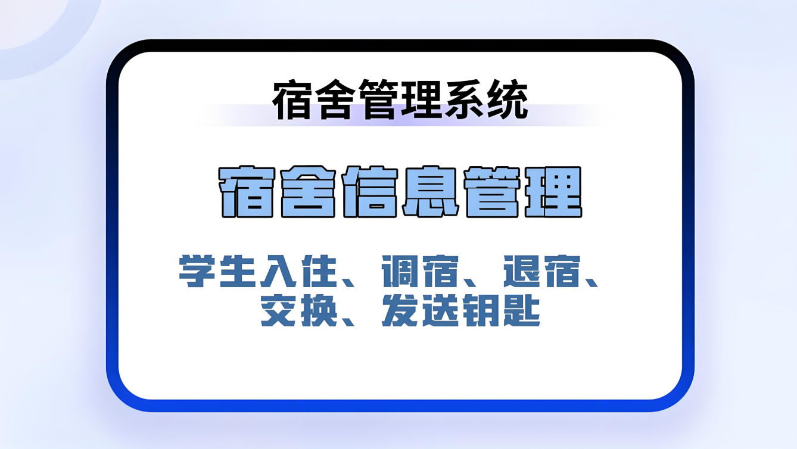

### 技术栈

- **后端**：Spring Boot
- **存储**：MySQL
- **前端**：Vue.js
- **开发工具**：IntelliJ IDEA（后端开发）、Navicat（数据库管理）

### 角色划分

1. **管理员**：拥有最高权限，可以管理所有业务功能，包括用户、宿舍、信息、申请、访客等。
2. **宿舍管理员**：负责管理宿舍相关的业务，如宿舍分配、宿舍检查、访客管理等。
3. **普通用户**：可以查看个人信息、提交申请、查看通知等。

### 业务功能整理

1. **用户管理**
    - 用户注册与登录
    - 用户信息维护（如修改密码、更新个人资料）
    - 用户角色管理（分配或修改用户角色）
    - 用户行为日志记录与查询

2. **宿舍管理**
    - 宿舍楼栋与房间信息管理（增删改查）
    - 宿舍分配与调整（为新生分配宿舍、调整宿舍等）
    - 宿舍设施维护与报修（记录报修信息、安排维修等）
    - 宿舍安全检查与记录（定期检查宿舍安全、记录检查结果）

3. **信息管理**
    - 通知公告发布与查看（发布重要通知、查看历史公告）
    - 规章制度查阅（提供规章制度文档、支持在线查阅）
    - 新闻资讯展示（展示校园新闻、行业动态等）

4. **申请管理**
    - 宿舍调换申请（用户提交调换宿舍的申请、管理员审批）
    - 访客预约申请（访客提前预约、宿舍管理员审批）
    - 设施维修申请（用户提交维修申请、宿舍管理员或管理员审批）
    - 申请状态查询（用户查询自己提交的申请状态）

5. **访客管理**
    - 访客登记与审核（访客登记个人信息、宿舍管理员审核）
    - 访客进出记录（记录访客进出时间、宿舍号等信息）
    - 访客黑名单管理（将违规访客加入黑名单、限制其再次访问）

6. **个人信息**
    - 个人资料查看与编辑（用户查看和编辑自己的个人信息）
    - 账户安全与密码管理（修改密码、绑定/解绑第三方账号等）
    - 我的申请与审批记录（用户查看自己提交的申请及审批结果）

### 开发工具使用

- **IntelliJ IDEA**：用于后端Spring Boot项目的开发、调试和部署。
- **Navicat**：用于MySQL数据库的管理，包括数据表设计、数据查询、数据备份与恢复等。

#### 说明
如果想要看项目的完整版视频可以联系我。如果需要定制化的话可以根据功能进行修改。

#### 毕设研究方向和计划安排
不知道怎么进行选择毕设或者选择毕设之后无从下手。全程协助完整技术支持。让你在答辩的时候对技术游刃有余。这条只对想要自己写毕设的人。

:tw-1f345: **添加QQ请备注：002毕设解答**

#### 联系我
QQ: 540182436
