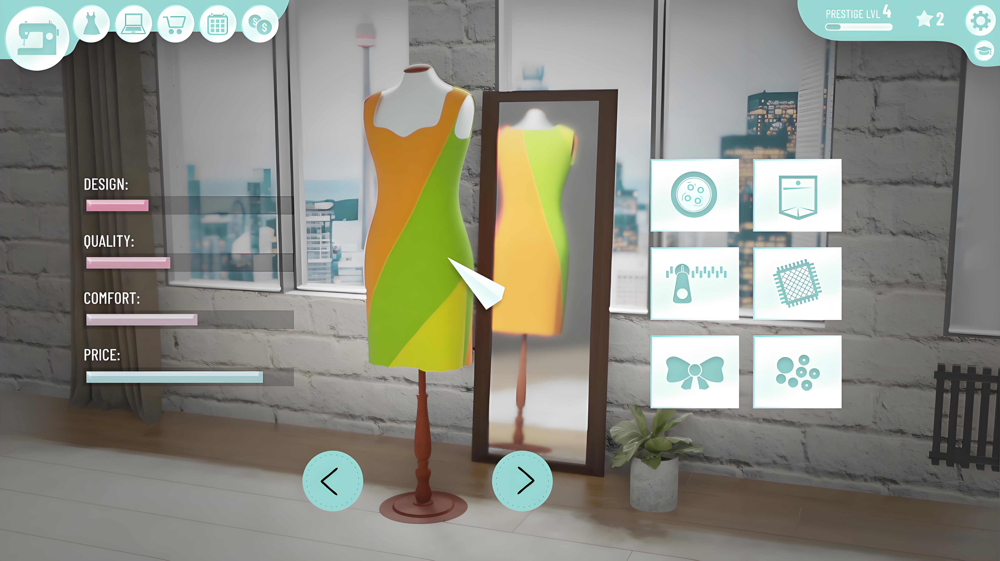

### 技术栈

- **后端**：Spring Boot
- **存储**：MySQL
- **前端**：Vue.js
- **开发工具**：IntelliJ IDEA（后端开发）、Navicat（数据库管理）

### 角色划分

1、**管理员**：拥有最高权限，可以查看图表、衣帽分类、衣物信息、搭配信息、搭配笔记、评论、公告、用户管理、个人信息等功能。
2、**普通用户**：可以查看首页、衣物信息、搭配信息、搭配笔记、个人中心中有个人衣物、我的搭配、发布搭配、我的衣物、发布衣物等功能。

### 业务功能整理

#### 管理员业务功能

1. **图表查看**：
   - 查看系统统计图表，如用户增长、活跃度等。

2. **衣帽分类管理**：
   - 添加、编辑、删除衣帽分类。
   - 查看所有分类及其详细信息。

3. **衣物信息管理**：
   - 查看所有衣物信息，包括详细信息、图片等。
   - 审核用户提交的衣物信息（如果设有审核机制）。

4. **搭配信息管理**：
   - 查看所有搭配信息，包括搭配的衣物、描述、图片等。
   - 审核用户提交的搭配信息（如果设有审核机制）。

5. **搭配笔记管理**：
   - 查看所有用户的搭配笔记。
   - 审核用户提交的搭配笔记（如果设有审核机制）。

6. **评论管理**：
   - 查看所有评论，包括衣物评论和搭配评论。
   - 对不当评论进行删除或屏蔽。

7. **公告管理**：
   - 发布、编辑、删除系统公告。
   - 查看所有已发布的公告。

8. **用户管理**：
   - 查看所有用户信息，包括注册时间、活跃度等。
   - 对用户进行权限管理，如提升或降低用户权限。
   - 处理用户反馈和投诉。

9. **个人信息管理**：
   - 查看并编辑自己的个人信息，如头像、昵称等。

#### 普通用户业务功能

1. **首页浏览**：
   - 浏览系统首页，查看推荐的衣物、搭配和笔记。

2. **衣物信息管理**：
   - 查看所有公开的衣物信息，包括详细信息、图片等。
   - 发布自己的衣物信息，包括上传图片、填写描述等。
   - 编辑或删除自己发布的衣物信息。

3. **搭配信息管理**：
   - 查看所有公开的搭配信息。
   - 发布自己的搭配信息，包括选择衣物、填写描述、上传图片等。
   - 编辑或删除自己发布的搭配信息。

4. **搭配笔记管理**：
   - 查看所有公开的搭配笔记。
   - 发布自己的搭配笔记，包括文字描述、图片等。
   - 编辑或删除自己发布的搭配笔记。

5. **个人中心**：
   - 查看并编辑自己的个人信息，如头像、昵称、联系方式等。
   - 管理自己的衣物信息，包括查看、编辑、删除等。
   - 管理自己的搭配信息，包括查看、编辑、删除等。
   - 查看自己的搭配笔记，包括编辑和删除。

6. **评论功能**：
   - 对衣物信息和搭配信息进行评论。
   - 查看并回复其他用户的评论。

7. **公告查看**：
   - 查看系统发布的所有公告。

### 开发工具使用

- **IntelliJ IDEA**：用于后端Spring Boot项目的开发、调试和部署。
- **Navicat**：用于MySQL数据库的管理，包括数据表设计、数据查询、数据备份与恢复等。

#### 说明
如果想要看项目的完整版视频可以联系我。如果需要定制化的话可以根据功能进行修改。

#### 毕设研究方向和计划安排
不知道怎么进行选择毕设或者选择毕设之后无从下手。全程协助完整技术支持。让你在答辩的时候对技术游刃有余。这条只对想要自己写毕设的人。

:tw-1f345: **添加QQ请备注：002毕设解答**

#### 联系我
QQ: 540182436
