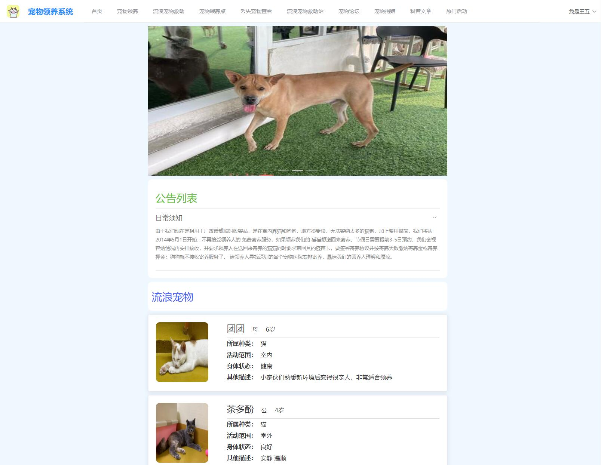

## 012宠物领养系统技术栈与业务模块概述

### 技术栈

本项目采用的技术栈组合为：

- **后端**：Spring Boot，提供高效、简洁的后端开发体验。
- **前端**：Vue.js，确保用户界面的交互性和响应速度。
- **数据库**：MySQL，负责存储和处理系统中的大量数据。

### 业务模块划分

#### 用户端模块

用户端主要功能包括：

1. **首页**：展示系统的主要信息和功能入口。
2. **宠物领养模块**：用户可浏览待领养的宠物信息，提交领养申请。
3. **流浪宠物救助模块**：展示流浪宠物的救助信息和救助流程。
4. **宠物喂养点模块**：提供宠物喂养点的位置和服务信息。
5. **丢失宠物模块**：用户可发布丢失宠物信息，寻求帮助。
6. **流浪宠物救助站模块**：展示救助站的位置、联系方式和救助活动。
7. **宠物论坛**：用户可参与宠物相关的讨论和交流。
8. **宠物捐赠模块**：用户可进行捐赠，支持流浪宠物的救助工作。
9. **科普文章模块**：提供宠物养护、救助等方面的科普知识。
10. **热门活动模块**：展示系统或合作伙伴举办的宠物相关活动。

#### 后台管理模块

后台管理模块主要包含：

1. **主页**：展示后台管理系统的概况和主要功能模块。
2. **系统管理**：
    - **用户管理**：管理用户信息，包括注册、审核、权限设置等。
    - **角色管理**：定义和管理用户角色，分配不同角色的权限。
    - **菜单管理**：配置后台管理系统的菜单结构和功能入口。
    - **文件管理**：管理上传的文件，如图片、文档等。
3. **流浪宠物管理**：记录和管理流浪宠物的信息，包括救助、领养等状态。
4. **带绝育动物管理**：记录已进行绝育手术的动物信息。
5. **申请领养管理**：审核和处理用户的领养申请。
6. **评论管理**：管理用户在论坛和宠物信息下方的评论。
7. **流浪动物救助管理**：记录和管理流浪动物的救助过程和结果。
8. **动物走势管理**：跟踪和分析动物的领养、救助等走势。
9. **帖子管理**：管理宠物论坛中的帖子，包括发布、审核、删除等。
10. **公告信息管理**：发布、编辑和删除系统公告，通知用户重要信息。

通过以上技术栈和业务模块的划分，本项目旨在为用户提供一个全面、便捷、高效的宠物领养和救助平台。
#### 说明
如果想要看项目的完整版视频可以联系我。如果需要定制化的话可以根据功能进行修改。

#### 毕设研究方向和计划安排
不知道怎么进行选择毕设或者选择毕设之后无从下手。全程协助完整技术支持。让你在答辩的时候对技术游刃有余。这条只对想要自己写毕设的人。

:tw-1f345: **添加QQ请备注：012毕设解答**

#### 联系我
QQ: 540182436
