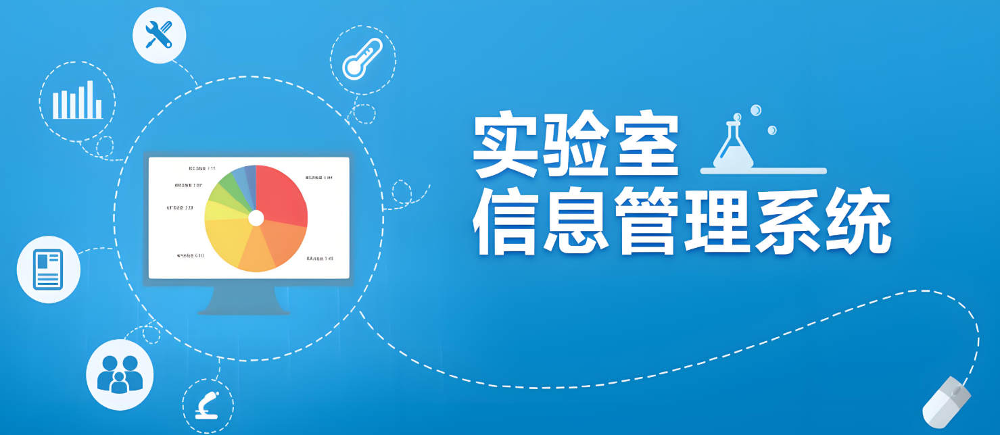

## 017-实验室预约管理系统
### 项目背景
随着高校教育信息化的不断推进，实验室作为教学和科研的重要场所，其管理和使用效率直接影响到教学和科研的质量。传统的实验室预约方式往往依赖于纸质表格或简单的电子表格记录，这种方式不仅效率低下，而且容易出错，难以满足现代高校对实验室管理的需求。为了提高实验室预约的效率和便捷性，实现实验室资源的优化配置，我们决定开发一套实验室预约管理系统。该系统旨在通过信息化手段，实现对实验室预约的在线管理，提高实验室资源的利用率，减轻管理人员的工作负担，同时为教师提供更加便捷、高效的实验室预约服务。

### 技术选型

- **后端**：Spring Boot
    - 选择Spring Boot作为后端框架，主要是因为其具备简洁、高效、易于部署和扩展的特点，能够快速构建稳定的RESTful API接口，为前端提供数据支持。

- **前端**：Vue.js
    - Vue.js作为前端框架，以其渐进式框架设计、易于上手和集成、以及强大的组件化开发能力，能够为用户提供流畅、响应式的界面体验。

- **存储**：MySQL
    - MySQL作为关系型数据库，具有高性能、高可用性和高可扩展性，能够满足系统对数据存储、查询和管理的需求。

### 系统功能概述

#### 系统管理员

- **用户管理**：负责系统中所有用户（包括实验室管理员、校级实验室管理员、教师等）的创建、修改、删除和权限分配。
- **学院管理**：对学院信息进行管理，包括学院的添加、修改和删除。
- **专业管理**：管理各学院下的专业信息，包括专业的添加、修改和删除。
- **在线用户**：实时监控系统中在线用户的状态，确保系统安全。
- **个人中心**：查看和修改个人信息，管理个人权限。
- **数据分析**：对实验室预约数据进行统计分析，生成报表，为决策提供支持。

#### 实验室管理员

- **实验室信息**：管理实验室的基本信息，包括实验室名称、位置、容量、设备清单等。
- **预约记录**：查看和处理实验室预约请求，包括审核预约、拒绝预约或调整预约时间。
- **个人中心**：查看和修改个人信息。
- **数据分析**：对实验室使用情况进行统计分析，优化实验室资源分配。

#### 校级实验室管理员

- **实验室信息**：管理全校所有实验室的基本信息，包括实验室的创建、修改和删除。
- **预约记录**：查看全校所有实验室的预约记录，监督实验室预约情况。
- **个人中心**：查看和修改个人信息。
- **数据分析**：对全校实验室使用情况进行统计分析，为全校实验室管理提供决策支持。

#### 教师

- **预约实验室**：在线预约实验室，选择实验室、预约时间和用途。
- **预约记录**：查看个人预约记录，包括已预约、待审核、已拒绝和已完成的预约。
- **实验室课表**：查看实验室的课表信息，了解实验室的空闲时间。
- **个人中心**：查看和修改个人信息。
- **数据分析**：对个人实验室使用情况进行统计分析，优化实验安排。

通过这套实验室预约管理系统，我们可以实现实验室资源的优化配置，提高实验室预约的效率和便捷性，为教学和科研提供更加有力的支持。

#### 毕设研究方向与计划安排

**研究方向**：
- **信息技术在政务服务中的应用**：探讨如何利用现代信息技术提升政务服务效率和质量。
- **用户体验设计**：研究如何设计符合用户需求、易于操作的界面和交互流程。
- **数据安全与隐私保护**：分析政务服务系统中的数据安全和隐私保护问题，提出解决方案。

**计划安排**：
1. **需求分析阶段**：明确项目目标、功能需求，制定详细的需求规格说明书。
2. **系统设计阶段**：根据需求分析结果，设计系统架构、数据库结构、界面原型等。
3. **系统开发阶段**：按照系统设计，分阶段进行后端、前端、小程序的开发工作。
4. **系统测试阶段**：对系统进行单元测试、集成测试、性能测试等，确保系统稳定性和可靠性。
5. **部署与上线阶段**：将系统部署到服务器上，进行上线前的最后调试和优化。
6. **论文撰写阶段**：整理项目文档，撰写毕业论文，包括项目背景、需求分析、系统设计、实现过程、测试结果等内容。
7. **答辩准备阶段**：准备答辩PPT，熟悉项目技术和论文内容，进行模拟答辩练习。

#### 定制化与技术支持

本项目提供定制化服务，可根据客户需求调整功能。同时，对于选择本项目作为毕业设计的学生，我们将提供全程技术支持和答辩指导，确保学生在答辩时能够游刃有余地展示项目成果和技术亮点。如有需要，可联系我们获取更多帮助。

:tw-1f345: **添加QQ请备注：017毕设解答**

#### 联系我
QQ: 540182436
