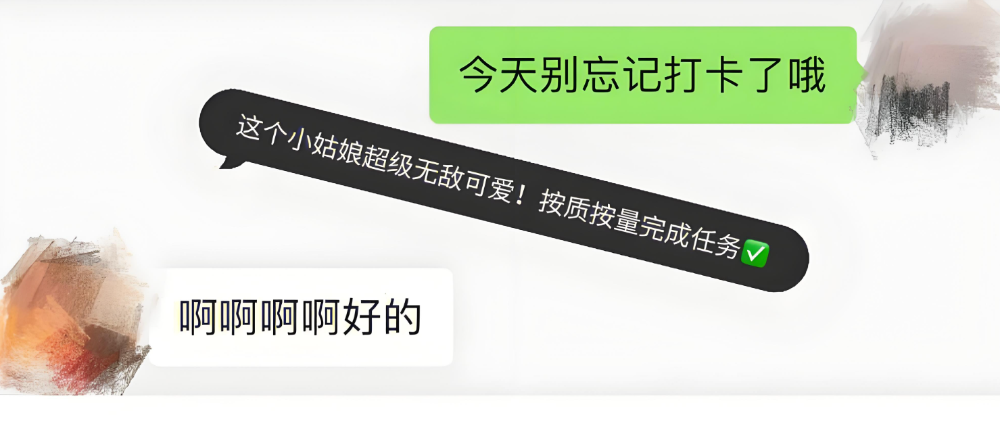

# 046-任务打卡系统

**任务打卡系统**

**技术框架**：
- **后端**：Spring Boot
- **前端**：UniApp + Vue.js
- **数据库**：MySQL

**管理端功能概览**：

1. **用户管理**：全面掌控用户信息，轻松进行用户增删改查。
2. **任务分类**：科学分类任务，便于管理和查找。
3. **任务信息**：详细展示任务详情，一目了然。
4. **积分商品**：设置积分兑换商品，激发用户参与热情。
5. **任务进度**：实时监控任务进度，确保任务按时完成。
6. **任务提醒**：智能提醒用户任务进度，避免遗漏。
7. **日记周报**：记录用户工作日常，方便总结与回顾。
8. **积分兑换**：支持用户积分兑换商品，提升用户粘性。
9. **奖惩信息**：记录用户奖惩情况，公正透明。
10. **留言反馈**：收集用户反馈意见，不断优化系统。
11. **交流论坛**：搭建用户交流平台，促进互动与分享。
12. **系统管理**：全面管理系统设置，确保系统稳定运行。
13. **我的信息**：个性化管理个人信息，方便快捷。

**用户端功能概览**：

1. **首页**：简洁明了，快速了解任务动态。
2. **任务信息**：详细展示任务详情，助力用户高效完成任务。
3. **任务进度**：实时查看个人任务进度，激励用户持续参与。
4. **交流论坛**：参与用户交流，分享心得与经验。
5. **我的**：个性化管理个人信息与积分，享受专属服务。

**系统亮点**：
- **技术先进**：采用Spring Boot + UniApp + Vue.js + MySQL技术框架，确保系统高效稳定。
- **功能全面**：管理端与用户端功能丰富，满足多样化需求。
- **用户体验**：界面简洁美观，操作流畅便捷，提升用户体验。
- **互动性强**：交流论坛模块促进用户互动与分享，增强用户粘性。

该系统旨在为用户提供便捷、高效的任务打卡体验，同时方便管理员进行全方位的管理与监控。

#### 说明
如果想要看项目的完整版视频可以联系我。如果需要定制化的话可以根据功能进行修改。

#### 毕设研究方向和计划安排
不知道怎么进行选择毕设或者选择毕设之后无从下手。全程协助完整技术支持。让你在答辩的时候对技术游刃有余。这条只对想要自己写毕设的人。

:tw-1f345: **添加QQ请备注：046毕设解答**

#### 联系我
QQ: 540182436
