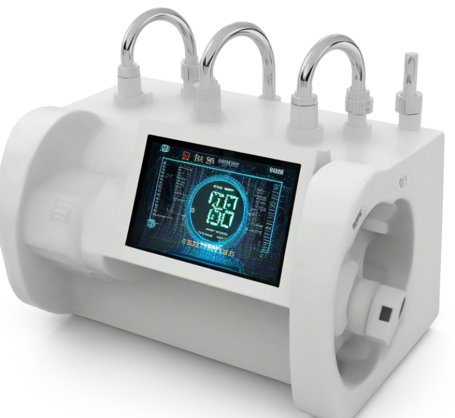

# 052-用水监控管理系统

#### 介绍
用水监控管理系统 springboot  java vuejs jdk1.8

当然，以下是一个简洁的用水监控管理系统的功能模块划分，基于Spring Boot（JDK 1.8）后端和Vue.js前端：

### 用水监控管理系统功能模块

#### 后端（Spring Boot）

1. **用户管理**
    - 用户注册与登录
    - 用户信息与权限管理

2. **水厂管理**
    - 水厂信息录入与维护
    - 水厂设备信息管理

3. **用水量管理**
    - 实时用水量监测
    - 历史用水量查询

4. **用水部署图管理**
    - 部署图绘制与展示
    - 部署图数据更新

5. **排污装置检测管理**
    - 排污装置信息录入
    - 排污装置状态监测

6. **水厂水库量管理**
    - 水库量实时监测
    - 水库量历史查询

7. **用水异常提醒**
    - 异常检测与通知

8. **用水数据分析**
    - 数据可视化展示
    - 数据报告生成

9. **系统管理**
    - 系统参数配置
    - 系统日志管理

#### 前端（Vue.js）

- **页面展示**：根据后端提供的数据，展示各个功能模块的内容。
- **交互功能**：实现用户与系统的交互，如数据录入、查询、修改等。
- **通知与提醒**：展示系统发送的通知和提醒信息。
- **数据可视化**：使用图表等形式展示用水数据和分析结果。
#### 说明
如果想要看项目的完整版视频可以联系我。如果需要定制化的话可以根据功能进行修改。

#### 毕设研究方向和计划安排
不知道怎么进行选择毕设或者选择毕设之后无从下手。全程协助完整技术支持。让你在答辩的时候对技术游刃有余。这条只对想要自己写毕设的人。

:tw-1f345: **添加QQ请备注：052毕设解答**

#### 联系我
QQ: 540182436
