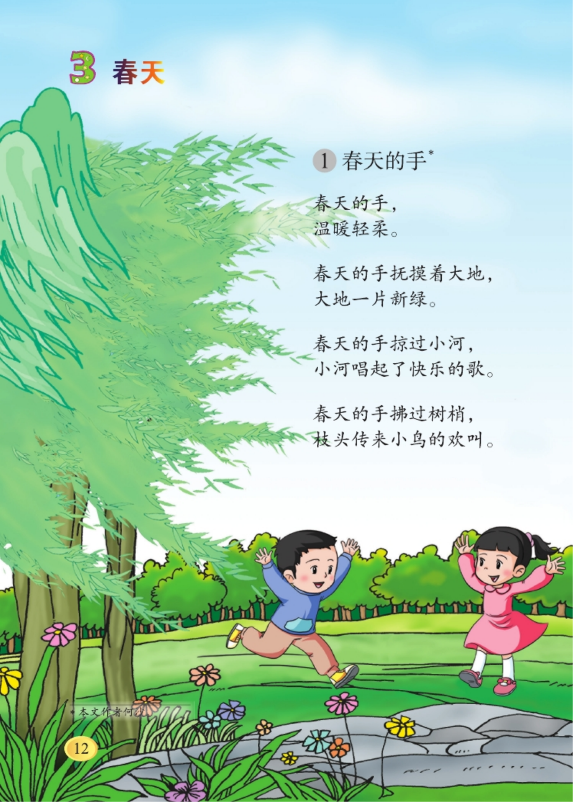

::: center

:::

当我翻开这本布纹封面的旧书时，细小的尘埃在阳光中旋舞，像无数颗未及落地的文字。牛皮纸扉页上洇开的咖啡渍，是十年前某个春日下午留下的时间标本。手指抚过微微发脆的书页，绸缎般的触感裹挟着油墨特有的醇香漫上鼻尖，恍惚间竟嗅到了泥土翻新的潮湿气息。
封面上那个头戴草帽的男孩正弓着背，将一株青翠的树苗小心地放进土坑。他的红领巾被春风掀起一角，远处山峦的墨线在雾霭中晕染，让我想起外婆总用赭石色毛线勾边的蓝布围裙。那时节总在清明前后，外公会扛着锈迹斑斑的锄头，领我穿过缀满婆婆纳的田埂。新翻的泥土在锄头下翻滚出油亮的波浪，蚯蚓蜷曲着粉红的身躯，田螺壳在沟渠里泛着青灰色的光。
"丫头，种子要像放鸡蛋似的轻拿轻放。"外公布满茧子的手掌托着几粒玉米种，掌纹里嵌着的黑土簌簌落在我的小花布鞋上。外婆提着竹篮跟在后面，篮里的红薯苗还沾着晨露，她总说这是"沾了月亮的灵气"。当我的小铲子掘歪了田垄，外公就蹲下来，用他缺了口的烟斗在地上划出笔直的线，"庄稼人写的字，要叫雨水读得顺畅"。
暮色降临时，远处的泡桐树会垂下淡紫色的铃铛。外婆撩起衣襟擦汗，从蓝布围裙兜里掏出用荷叶包着的艾草团子。蝉鸣声里，外公教我辨认刚冒头的秧苗："豆瓣菜两瓣叶像蝴蝶翅膀，苋菜的芽尖总爱顶着露珠帽子。"那些浸润着汗水的农耕智慧，如今竟与书页间的光合作用示意图重叠成奇妙的光斑。
合上书时，夕阳正给窗台上的绿萝镀上金边。恍惚看见那年插在田头的枯树枝，不知何时已长成亭亭如盖的模样。风穿过楼宇间的缝隙，捎来几不可闻的稻花香——或许那是二十年前落在书页间的，某粒被遗忘的野燕麦种子，正在字里行间悄悄抽穗。

::: center

:::

暮色初合时，老街的青砖缝里已渗出暖黄的光晕。竹骨宣纸灯笼在檐角次第亮起，细雪落在彩绘的嫦娥奔月图上，洇开几朵透明的冰花。巷口卖糖画的老人将铜勺往青石板上轻轻一叩，糖稀流淌的金线便勾住了最后一缕暮紫天光。
书包里新发的课本还带着油墨的潮气，《元宵节》的铅字在路灯下泛着青蓝。我望着扉页插画里穿棉袍的孩童，他们举着的莲花灯竟与橱窗里的电子灯笼重叠——那些会唱歌的塑料兔子正眨着七彩眼睛，可父亲总说纸糊的走马灯才看得见风的形状。
"小心烫着。"母亲掀开蒸笼，团团圆圆的白玉珠在热气中浮沉。糯米香裹着桂花蜜渗进木纹桌缝，让我想起除夕夜祖父亲手写的春联。他总把"福"字倒贴在米缸上，苍劲的笔锋里藏着麦穗的弧度："仓廪实才能灯笼明啊。"
窗外的烟花突然绽成漫天火树，瞬间照亮邻家妹妹新袄上的盘花扣。她腕间叮咚作响的银镯，与插画里孩童戴的长命锁在火光中交相辉映。父亲往我碗里添了勺酒酿，醪糟的醇香漫过舌尖时，我忽然懂得课本上那句"火树银花合"原是有温度的。
河灯顺水漂远的刹那，对岸升起盏盏孔明灯。外婆曾说这些飘摇的光点是人间寄给月亮的信笺，此刻它们正掠过新建的玻璃幕墙，在霓虹中辟出一条暖黄的星河。母亲指着手机里除夕守岁的照片：虚拟烟花在屏幕上绽放，而祖父的藤椅永远空在团圆饭桌旁。
"来写心愿笺。"父亲递来裁好的红纸，他的白发在灯笼映照下宛如落雪。我摸着课本里夹的压岁钱——崭新的纸币上，拓印着航天器的暗纹。当墨笔悬在纸面时，窗外的许愿灯忽然集体转向，仿佛被某个来自未来的引力轻轻牵动。
零点的钟声撞碎冰棱，电子灯笼与纸灯在雪夜里明明灭灭。课本里的元宵古诗正在智能手表上滚动播放，而我的手心还攥着祖父留下的青铜钱。当跨江大桥的灯光秀点亮天际时，我忽然看见时光的河面上，古老的年轮正生长出新的涟漪。

::: center

:::

行李箱滚过地铁站瓷砖时，碾碎了最后一片山雾。钢筋森林的玻璃幕墙上，倒映着老槐树蜷曲的枝桠——那是我昨夜用指甲在起雾的窗上画下的图腾。新买的西装口袋里，母亲塞进的艾草香囊正与打印墨盒争夺呼吸权，暗绿叶片间渗出的苦香，总让我想起晒谷场石缝里倔强的青蒿。

出租屋空调外机滴落的水珠，在防盗窗上敲出采茶调的节拍。视频通话时，父亲总把镜头对准檐角褪色的八卦镜，那上面还缠着我离家时断线的风筝尾巴。"昨儿暴雨冲垮了晒场东头，"他的声音裹着电流声，"你刻在青石板上的棋盘倒越发清楚了。"

江南梅雨季的傍晚，我会在便利店的落地窗前看霓虹灯坠入积水。那些破碎的光斑总幻化成水乡歌谣里的菱角舟，乌篷船头晾晒的蓝印花布，此刻正在某座商业综合体的LED屏上循环展播。新同事笑我总把咖啡喝成青瓷盏的姿势，他们不知道我舌尖始终悬着老井水的回甘。

地铁穿过江底隧道的轰鸣里，我听见石拱桥下捣衣的棒槌声。手机备忘录里躺着房东的缴费通知，最新一条却是母亲发来的语音："后山野柿红透了，给你晒的柿饼吊在西厢房。"当加班到凌晨三点，保温杯底沉着的枸杞突然像极了晒秋时的辣椒碎。

立冬那日收到故乡寄来的包裹，竹编礼盒里躺着十二枚土鸡蛋。我用公司碎纸机里的纸条絮了个窝，蛋壳上的褐色斑点竟与老屋墙根的雨渍惊人相似。主管经过时笑问这是什么行为艺术，我望着孵化器般的电脑主机说："在养一窝会下金蛋的母鸡。"

年关抢票时，朋友圈开始疯传拆迁公告的照片。晒得发白的公告栏上，我幼年画的小太阳还在歪着头笑。视频里推土机碾过菜畦的瞬间，邻居阿婆突然从镜头外递来沾着新泥的萝卜："带着土才甜，城里的菜缺了地气。"

雨水惊醒了写字楼的绿萝，垂下的气根正在模仿爬山虎的走笔。当我用会议纪要折纸船放入马桶，漩涡中忽然浮现祠堂天井的四方星空。此刻故乡应是在落雪，那些轻盈的六角形结晶，是否正温柔地覆盖着童年刻在门楣上的身高刻度？

霓虹深处，总有青苔在空调排水管口悄然蔓生。就像我西装内衬永远别着的桃木扣——它来自老宅门前的春联钉，现在正替我收集所有城市星光，好在某个黎明将其锻造成带露的稻花。

::: center

:::

